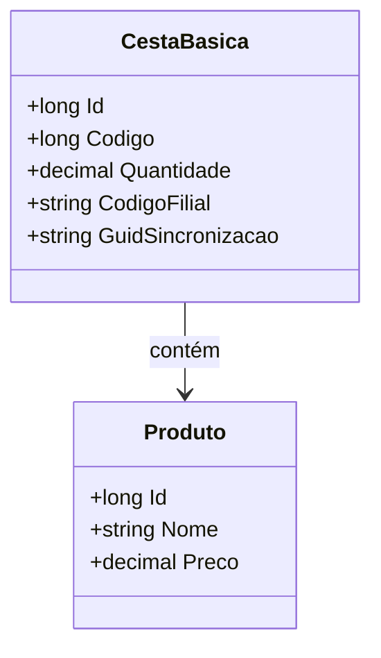

# CestaBasica
**Namespace**: IsthmusWinthor.Dominio.Entidades  
**Nome do Arquivo**: CestaBasica.cs  

A classe `CestaBasica` representa uma entidade do domínio relacionada à composição de cestas básicas dentro do sistema. Ela tem a finalidade de modelar a relação entre um produto da cesta e as informações necessárias para gerenciar a quantidade e a identificação na filial.

## Navegação e Propriedades
- **Navigations Property**:
  - [Produto](Produto.md): Representa o produto associado à cesta básica.

## Tipos Auxiliares e Dependências
Não existem enumeradores ou classes estáticas/helpers diretamente utilizadas na classe `CestaBasica`.

## Diagrama de Relacionamentos

Neste diagrama, a classe `CestaBasica` possui uma associação com a classe `Produto`, indicando que a cesta básica é composta por um ou mais produtos.
