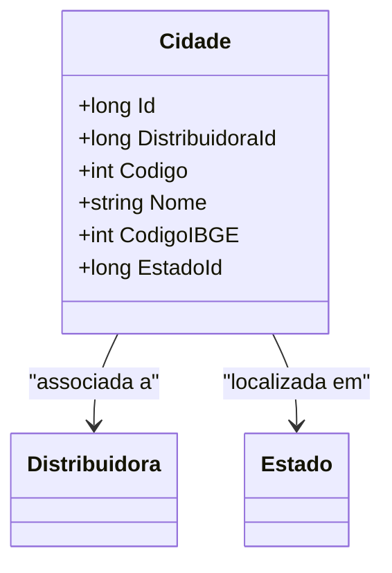

# Cidade
**Namespace**: IsthmusWinthor.Dominio.Entidades  
**Nome do Arquivo**: Cidade.cs  

## Visão Geral e Responsabilidade
A classe `Cidade` representa uma entidade dentro do domínio que encapsula as informações relacionadas a uma cidade específica. Ela está vinculada a uma `Distribuidora` e um `Estado`, permitindo assim a agregação de dados pertinentes à geolocalização e à estrutura organizacional da distribuidora. O principal problema de negócio que esta classe resolve é a necessidade de representar e validar informações críticas sobre localidades geográficas de forma que se possa gerir a distribuição de produtos ou serviços efetivamente.

## Métodos de Negócio
### Título: (Métodos não identificados)
**Objetivo**: Não há métodos com lógica de negócios complexa.

## Propriedades Calculadas e de Validação
- **Código**: Representa um código único para a cidade, possivelmente destinado à identificação interna. A validação deste valor deve garantir que não haja duplicidade.
- **Nome**: Deve ser validado para não aceitar valores nulos ou vazios, garantindo que uma cidade sempre tenha um nome reconhecível.
- **CodigoIBGE**: Semelhante ao `Código`, deve ser validado para assegurar que reflita as normas do IBGE e não contenha números inválidos.

## Navigations Property
- [`Distribuidora`](Distribuidora.md): Representa a relação com a distribuidora associada à cidade.
- [`Estado`](Estado.md): Representa a relação com o estado em que a cidade está localizada.

## Tipos Auxiliares e Dependências
- [IEntidade](IEntidade.md): Interface que a classe `Cidade` implementa, garantindo que siga o contrato de entidades do domínio.

## Diagrama de Relacionamentos

---
Gerada em 29/12/2025 20:20:01
