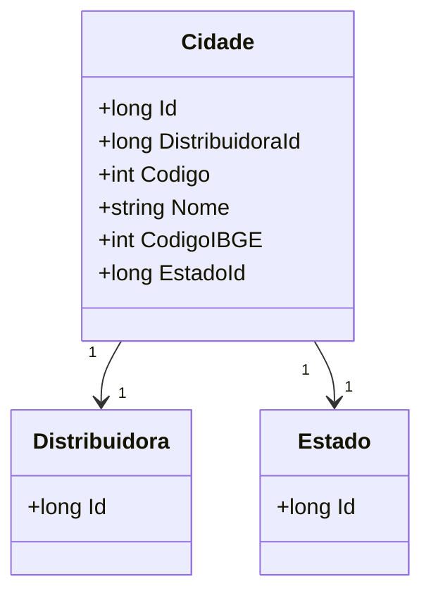

# Cidade
**Namespace**: IsthmusWinthor.Dominio.Entidades  
**Nome do Arquivo**: Cidade.cs  

## Visão Geral e Responsabilidade
A classe `Cidade` representa uma entidade do domínio que encapsula informações sobre uma cidade. Sua principal responsabilidade é modelar a relação entre uma cidade, sua distribuidora associada e seu estado. O problema de negócio que esta classe resolve é a necessidade de manter dados coerentes e integrados sobre cidades, permitindo consultas e operações que envolvam a estrutura geográfica e administrativa necessária para o sistema.

## Métodos de Negócio
Nenhum método de negócio foi identificado nesta classe que contenha lógica complexa ou de validação que requeira documentação detalhada.

## Propriedades Calculadas e de Validação
Nenhuma propriedade calculada ou de validação foi encontrada nesta classe.

## Navigations Property
- `[Distribuidora](Distribuidora.md)`
- `[Estado](Estado.md)`

## Tipos Auxiliares e Dependências
Nenhum enumerador ou classe estática/helper foi identificado nas dependências desta classe.

## Diagrama de Relacionamentos

