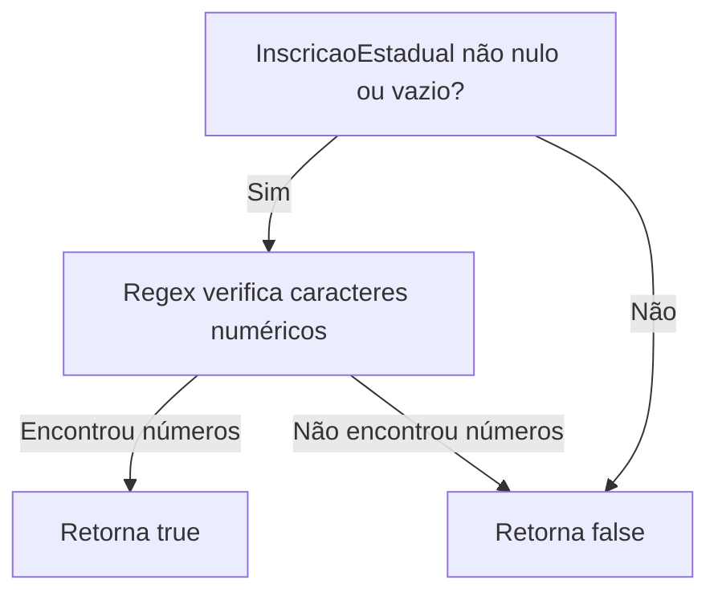
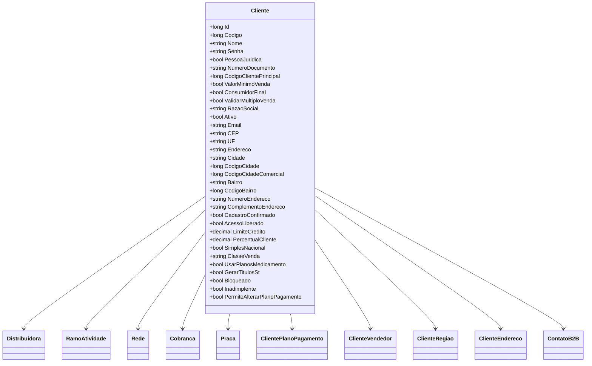

# Cliente
**Namespace**: IsthmusWinthor.Dominio.Entidades  
**Nome do Arquivo**: Cliente.cs  

## Visão Geral e Responsabilidade
A classe `Cliente` representa um cliente no sistema, abrangendo tanto pessoas físicas quanto pessoas jurídicas. Ela gerencia as informações pertinentes ao cadastro do cliente, como dados pessoais, credenciais de acesso, e características que afetam sua interação com o sistema de vendas. Esta classe é crucial para garantir a integridade dos dados relacionados a clientes e possibilitar ações de negócio, como validações de elegibilidade para crédito e controle de acesso a diferentes funcionalidades do sistema.

## Métodos de Negócio

### Método: `PossuiInscricaoEstadual()` - `public`
- **Objetivo**: Garante que o cliente tenha uma inscrição estadual válida, retornando um booleano que indica a presença de caracteres numéricos na string da inscrição.
- **Comportamento**:
  1. Verifica se o atributo `InscricaoEstadual` não está nulo ou vazio.
  2. Utiliza uma expressão regular para determinar se a string contém caracteres numéricos.
  3. Retorna `true` se houver caracteres numéricos, caso contrário, retorna `false`.
- **Retorno**: Um valor booleano que indica se o cliente possui uma inscrição estadual válida.

## Propriedades Calculadas e de Validação
- **InscricaoEstadual**: A propriedade não é apenas um transporte de dados. Sua validação está atrelada à lógica do método `PossuiInscricaoEstadual()`, que confirma se é um valor válido para a operação comercial.

## Navigation Property
- `[Distribuidora](Distribuidora.md)`
- `[RamoAtividade](RamoAtividade.md)`
- `[Rede](Rede.md)`
- `[Cobranca](Cobranca.md)`
- `[Praca](Praca.md)`
- `[ClientePlanoPagamento](ClientePlanoPagamento.md)`
- `[ClienteVendedor](ClienteVendedor.md)`
- `[ClienteRegiao](ClienteRegiao.md)`
- `[ClienteEndereco](ClienteEndereco.md)`
- `[ContatoB2B](ContatoB2B.md)`

## Tipos Auxiliares e Dependências
- `IEntidade`: Interface que a classe `Cliente` implementa.
- `ClientePlanoPagamento`, `ClienteVendedor`, `ClienteRegiao`, e `ClienteEndereco`: Classes que podem encapsular comportamentos e dados adicionais relacionados ao cliente.
- `Regex`: Utilizado para validação da inscrição estadual.

## Diagrama de Relacionamentos

