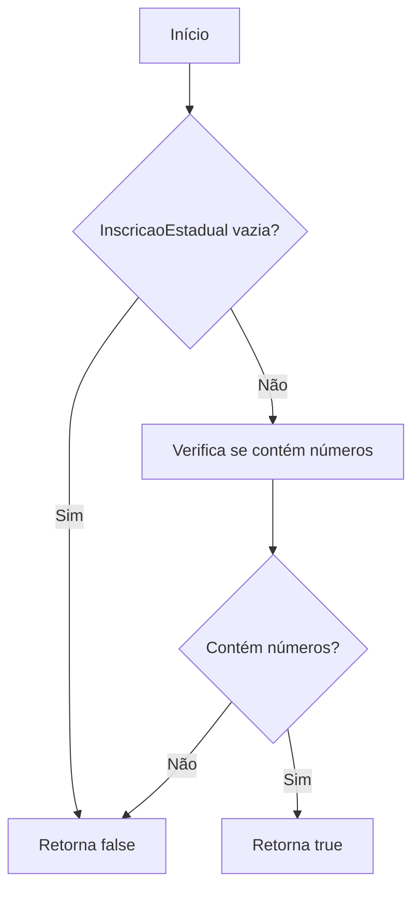
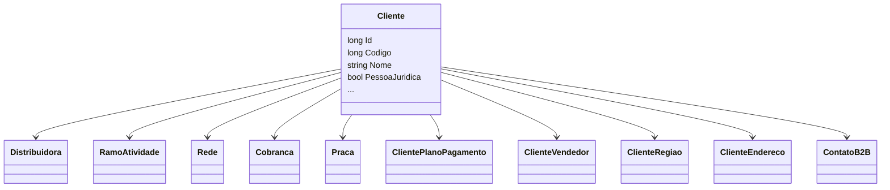

# Cliente
**Namespace**: IsthmusWinthor.Dominio.Entidades  
**Nome do Arquivo**: Cliente.cs  

## Visão Geral e Responsabilidade
A classe `Cliente` representa um cliente no contexto do sistema de gerenciamento de vendas. Ela é responsável por encapsular dados relacionados ao cliente, incluindo informações de contato, detalhes de cadastro e preferências comerciais. Através dessa classe, o sistema fornece funcionalidades como validação de inscritos estaduais, controle de acesso e gerenciamento de limite de crédito, garantindo a integridade e autenticidade das informações do cliente.

## Métodos de Negócio

### PossuiInscricaoEstadual: public
- **Objetivo**: Garante que o cliente possui uma inscrição estadual válida, verificando se existe algum elemento numérico na string fornecida.
- **Comportamento**: 
  1. Verifica se a propriedade `InscricaoEstadual` não é nula ou vazia.
  2. Utiliza uma expressão regular para tentar encontrar pelo menos um número na string da inscrição.
  3. Retorna `true` se um ou mais números forem encontrados; caso contrário, retorna `false`.
- **Retorno**: Retorna um valor booleano que indica a presença ou ausência de um número na inscrição estadual.

## Propriedades Calculadas e de Validação
- **InscricaoEstadual**: A propriedade valida se contém informações válidas, definindo a regra de negócio que exige a presença de números na inscrição.

## Navigation Properties
- [Distribuidora](Distribuidora.md)
- [RamoAtividade](RamoAtividade.md)
- [Rede](Rede.md)
- [Cobranca](Cobranca.md)
- [Praca](Praca.md)
- [ClientePlanoPagamento](ClientePlanoPagamento.md)
- [ClienteVendedor](ClienteVendedor.md)
- [ClienteRegiao](ClienteRegiao.md)
- [ClienteEndereco](ClienteEndereco.md)
- [ContatoB2B](ContatoB2B.md)

## Tipos Auxiliares e Dependências
- **Enums**: Nenhum enum utilizado diretamente pela classe `Cliente`.
- **Classes Estáticas/Helpers**: Nenhuma classe estática ou helper utilizada diretamente pela classe `Cliente`.

## Diagrama de Relacionamentos

---
Gerada em 29/12/2025 20:20:15
