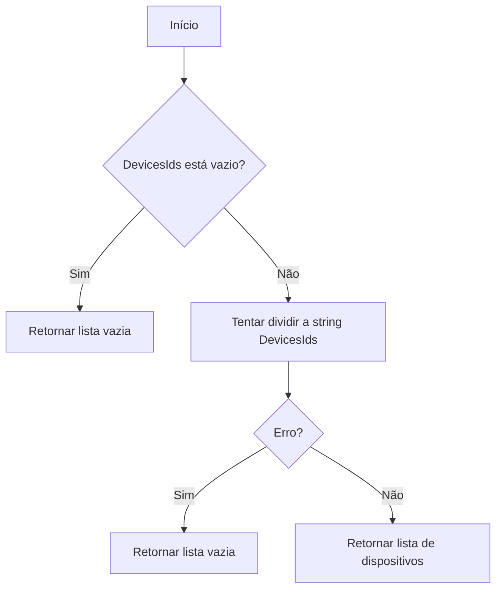
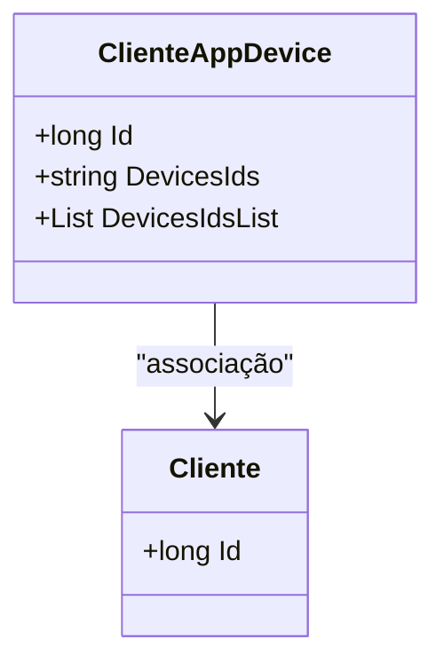

# ClienteAppDevice

**Namespace**: IsthmusWinthor.Dominio.Entidades  
**Nome do Arquivo**: ClienteAppDevice.cs

## Visão Geral e Responsabilidade
A classe `ClienteAppDevice` representa a relação entre um cliente e os dispositivos associados a ele. Este modelo é fundamental para o gerenciamento dos dispositivos que um cliente utiliza dentro do sistema. Ele resolve a necessidade de manter um registro dos dispositivos e facilitar operações como a autenticação e o controle de acesso a partir de um dispositivo específico.

## Métodos de Negócio

### Título: DevicesIdsList (Visibilidade: public)
- **Objetivo**: Garantir que a lista de IDs de dispositivos seja acessível em um formato utilizável, mesmo que a string original contenha falhas, como IDs malformados.
- **Comportamento**: 
  1. Verifica se `DevicesIds` está vazio ou nulo.
  2. Se estiver vazio, retorna uma nova lista vazia.
  3. Caso contrário, tenta dividir a string `DevicesIds` em uma lista usando a vírgula como delimitador.
  4. Remove espaços em branco ao redor de cada ID.
  5. Retorna a lista de dispositivos (ou uma lista vazia em caso de erro).
- **Retorno**: Retorna uma lista de strings contendo os IDs dos dispositivos. Se ocorrer um erro durante o processamento, retorna uma lista vazia.

## Propriedades Calculadas e de Validação

### DevicesIdsList
A propriedade `DevicesIdsList` processa a string `DevicesIds` e a transforma em uma lista de dispositivos. Se houver algum erro no processamento (ex., a string estiver formatada incorretamente), a propriedade garante que uma lista vazia será retornada, evitando falhas no sistema.

## Navigation Property

- `Cliente`: [Cliente](Cliente.md)

## Tipos Auxiliares e Dependências

- Nenhum enumerador ou classe estática utilizada diretamente nesta classe.

## Diagrama de Relacionamentos

---
Gerada em 29/12/2025 20:20:26
