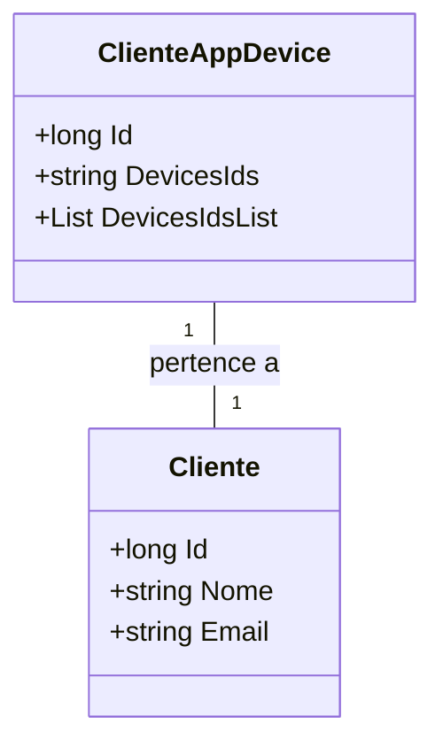

# ClienteAppDevice

**Namespace**: IsthmusWinthor.Dominio.Entidades  
**Nome do Arquivo**: ClienteAppDevice.cs

## Visão Geral e Responsabilidade
A classe `ClienteAppDevice` representa um dispositivo associado a um cliente em um sistema de aplicativos. Sua principal responsabilidade é gerenciar a relação entre um cliente e os dispositivos que ele possui, permitindo assim um controle eficaz sobre a quantidade e os tipos de dispositivos utilizados por cada cliente. Essa funcionalidade é essencial para a manutenção da integridade das interações e serviços oferecidos a cada cliente, garantindo que as comunicações e as operações do sistema estejam sempre conectadas a dispositivos válidos.

## Métodos de Negócio
### Propriedade: DevicesIdsList (Visibilidade: pública)
- **Objetivo**: Esta propriedade garante que uma lista manipulável de IDs de dispositivos seja sempre acessível e que reflita com precisão os dispositivos que o cliente possui, independentemente do formato da string armazenada.
- **Comportamento**:
  1. Verifica se a propriedade `DevicesIds` está vazia ou nula.
  2. Se estiver vazia, retorna uma lista vazia.
  3. Se não estiver, tenta dividir a string `DevicesIds` em uma lista de IDs de dispositivos, tratado cada ID para remover espaços em branco adicionais.
  4. Em caso de exceção durante o processamento, retorna uma lista vazia.
- **Retorno**: Retorna uma lista de strings representando os IDs dos dispositivos. 

```mermaid
flowchart TD
    A[DevicesIds está vazia?] -->|Sim| B[Retorna nova List<string>()]
    A -->|Não| C[Tenta dividir DevicesIds]
    C --> D[Substitui IDs com espaços em branco]
    C -->|Falha| E[Retorna nova List<string>()]
    C --> F[Retorna lista dos IDs de dispositivos]
```

## Propriedades Calculadas e de Validação
### DevicesIdsList
- Esta propriedade garante que a transformação da string dos IDs dos dispositivos seja feita de forma robusta, evitando falhas ao manipular os dados. A regra por trás do cálculo assegura que a lista retornada sempre contenha apenas IDs formatados corretamente e seja resiliente a dados malformados.

## Navigation Property
- `Cliente`: `[Cliente](Cliente.md)`

## Tipos Auxiliares e Dependências
- Nenhum enumerador ou classe auxiliar significativa é utilizada diretamente nesta classe.

## Diagrama de Relacionamentos


Esta documentação fornece uma visão clara da classe `ClienteAppDevice`, abrangendo suas responsabilidades dentro do sistema e as regras de negócio que garantem a integridade dos dados dos dispositivos associados a cada cliente.
