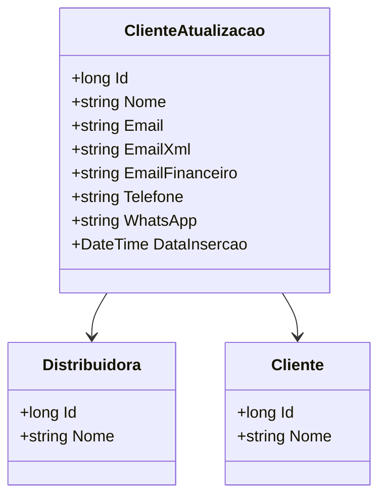

# ClienteAtualizacao
- **Namespace**: IsthmusWinthor.Dominio.Entidades
- **Nome do Arquivo**: ClienteAtualizacao.cs

## Visão Geral e Responsabilidade
A classe `ClienteAtualizacao` representa uma entidade do domínio responsável por manter e gerenciar as informações atualizadas de um cliente, associando-o a uma distribuidora específica. Ela resolve o problema de negócio de consolidar dados relevantes de clientes para manutenções, evitando inconsistências e assegurando que todas as atualizações sejam registradas adequadamente, como nome, email, telefone e outros dados de contato.

## Métodos de Negócio
### **Método: [Não definido explicitamente]**
- **Objetivo**: Não existem métodos implementados nesta classe que realizem lógica de negócio, já que as operações consistem apenas em propriedades anêmicas e associações a outras entidades.

## Propriedades Calculadas e de Validação
- Nenhuma propriedade apresenta lógica de cálculo ou validação na implementação atual.

## Navigations Property
- [Distribuidora](Distribuidora.md)
- [Cliente](Cliente.md)

## Tipos Auxiliares e Dependências
Nenhum enumerador ou classe estática/helper é utilizado na classe `ClienteAtualizacao`.

## Diagrama de Relacionamentos

