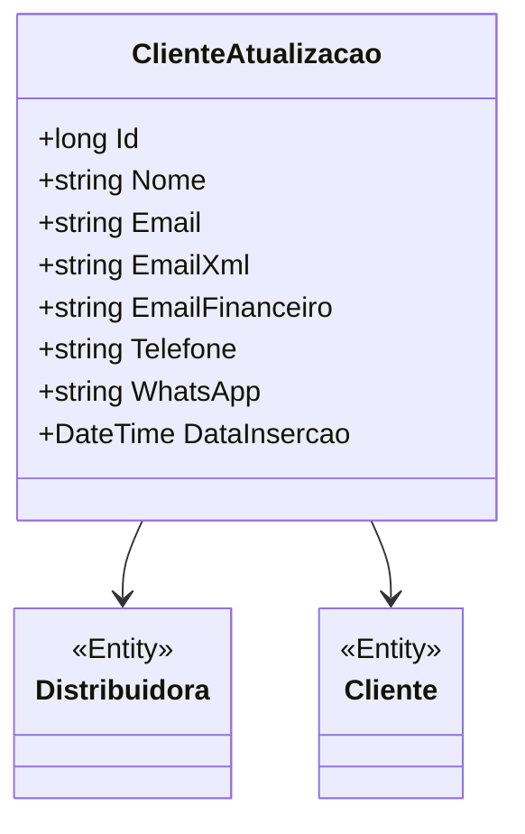

# ClienteAtualizacao
**Namespace**: IsthmusWinthor.Dominio.Entidades  
**Nome do Arquivo**: ClienteAtualizacao.cs  

## Visão Geral e Responsabilidade
A classe `ClienteAtualizacao` representa uma entidade do domínio que registra as atualizações associadas a um cliente específico. Esse modelo é crucial para gerenciar informações de contato e distribuir atualizações relevantes, garantindo que a comunicação com o cliente esteja sempre atualizada e precisa. A classe promove a integridade dos dados ao manter a relação entre o cliente e a distribuidora, além de permitir o armazenamento de múltiplas informações de contato.

## Métodos de Negócio
Atualmente, a classe `ClienteAtualizacao` não possui métodos com lógica de negócios complexa, apenas propriedades para transporte de dados. Portanto, não há métodos a serem documentados.

## Propriedades Calculadas e de Validação
- **Nome**: Armazena o nome do cliente. (Nenhuma lógica de validação implementada)
- **Email**: Endereço de email principal do cliente.
- **EmailXml**: Endereço de email para comunicação de dados em XML, sem validações específicas.
- **EmailFinanceiro**: Endereço específico para comunicação financeira, também sem validações.
- **Telefone**: Número de telefone do cliente.
- **WhatsApp**: Número de WhatsApp do cliente.
- **DataInsercao**: Data em que a atualização foi registrada.

## Navigations Property
- [Distribuidora](Distribuidora.md): Referencia à distribuidora associada.
- [Cliente](Cliente.md): Referencia ao cliente correspondente.

## Tipos Auxiliares e Dependências
Nenhum enumerador ou classe auxiliar complexa é utilizado nesta classe.

## Diagrama de Relacionamentos

---
Gerada em 29/12/2025 20:20:32
