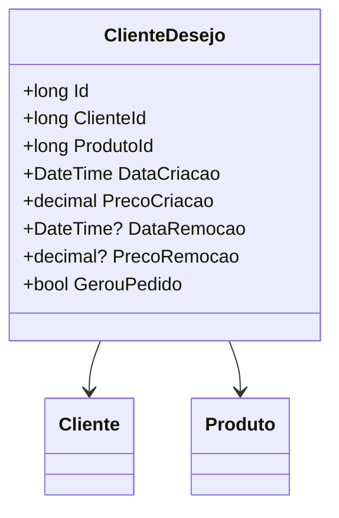

# ClienteDesejo
- **Namespace**: IsthmusWinthor.Dominio.Entidades
- **Nome do Arquivo**: ClienteDesejo.cs

## Visão Geral e Responsabilidade
A classe `ClienteDesejo` representa o desejo de um cliente por um produto específico, servindo como uma estrutura que facilita o acompanhamento dos interesses dos clientes em relação a produtos. Esta entidade é vital para compreender quais itens despertam interesse em uma base de clientes, permitindo ações direcionadas em estratégias de venda e marketing. O problema de negócio que ela resolve é a identificação e monitoramento das preferências do cliente, que podem ser transformadas em oportunidades de vendas.

## Métodos de Negócio
- **Título**: *N/A*  
  **Objetivo**: A classe `ClienteDesejo` não possui métodos de negócio que envolvam lógica complexa, sendo mais uma estrutura de dados.

## Propriedades Calculadas e de Validação
- Nenhuma propriedade com lógica de cálculo ou validação foi identificada.

## Navigations Property
- [Cliente](Cliente.md)
- [Produto](Produto.md)

## Tipos Auxiliares e Dependências
- Nenhum enumerador ou classe estática/helper foi utilizado pela classe `ClienteDesejo`.

## Diagrama de Relacionamentos

---
Gerada em 29/12/2025 20:20:39
