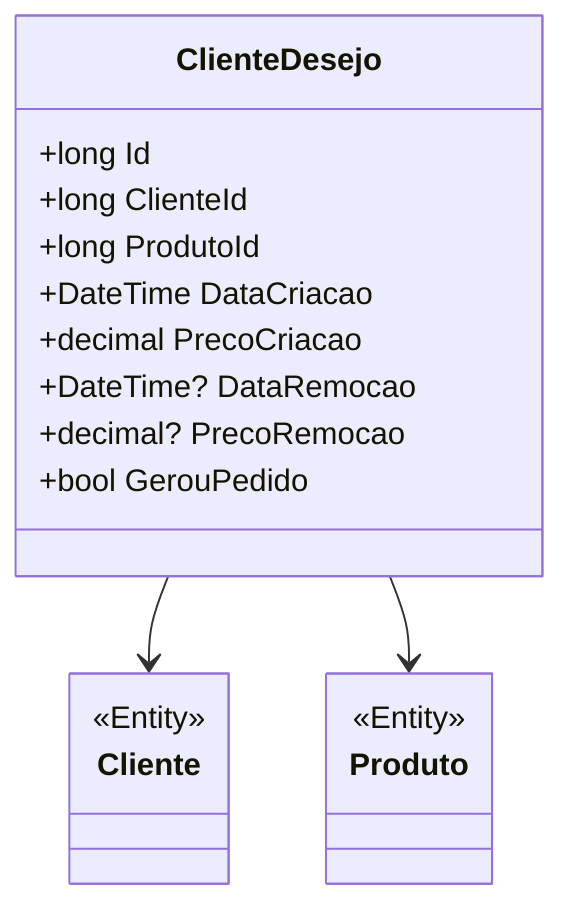

# ClienteDesejo
**Namespace**: IsthmusWinthor.Dominio.Entidades  
**Nome do Arquivo**: ClienteDesejo.cs  

## Visão Geral e Responsabilidade
A classe `ClienteDesejo` representa a intenção ou o desejo de um cliente em adquirir um produto específico. Esse modelo é crucial para o gerenciamento do processo de vendas, pois permite que a empresa rastreie os interesses dos clientes e utilize essas informações para gerar ofertas personalizadas, melhorar a experiência do cliente e potencialmente aumentar as taxas de conversão de vendas. O objetivo é garantir que os desejos registrados sejam considerados no fluxo de pedidos e que a comunicação com o cliente seja otimizada.

## Métodos de Negócio
Como a classe `ClienteDesejo` não apresenta métodos com lógica complexa própria, não há métodos de negócio a serem detalhados neste momento.

## Propriedades Calculadas e de Validação
- **DataRemocao**: Esta propriedade é um campo opcional que indica quando o desejo foi removido. Se houver uma data de remoção, isso pode significar que o desejo não é mais válido ou que o cliente não está mais interessado.
- **PrecoRemocao**: Similar à `DataRemocao`, essa propriedade armazena o preço associado ao desejo no momento da remoção. Essa validação garante que as informações de preço estejam disponíveis caso o desejo seja reativado ou reavaliado posteriormente.

## Navigations Property
- `[Cliente](Cliente.md)`: Representa o cliente associado ao desejo.
- `[Produto](Produto.md)`: Representa o produto que o cliente deseja adquirir.

## Tipos Auxiliares e Dependências
- Não há enumeradores ou classes auxiliares diretamente utilizadas nesta classe que precisem ser referenciadas.

## Diagrama de Relacionamentos

