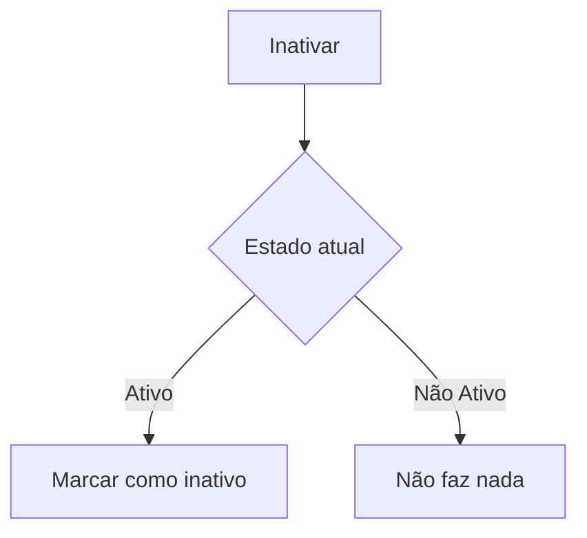
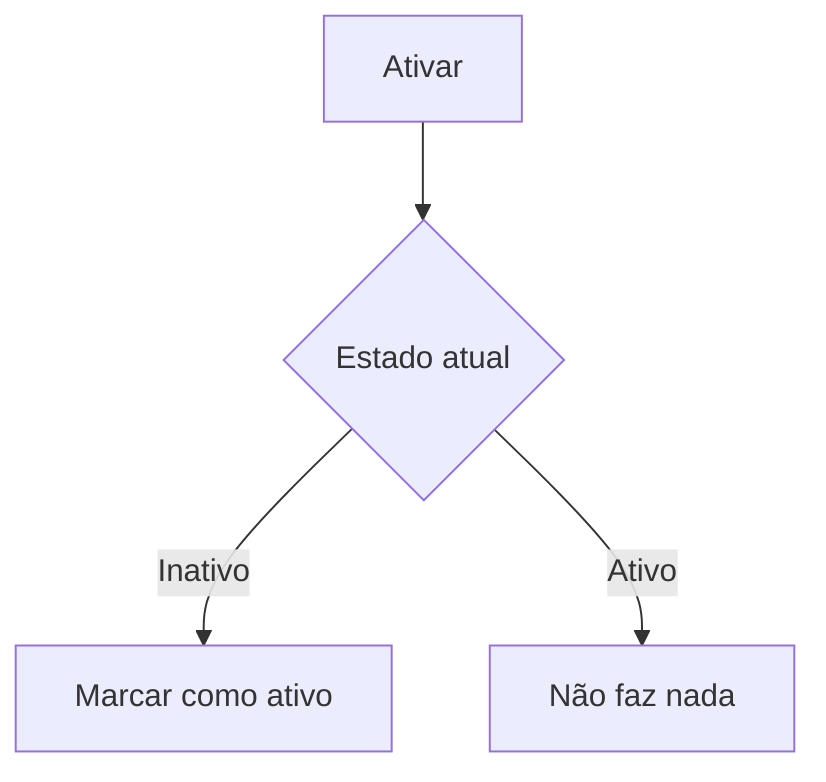
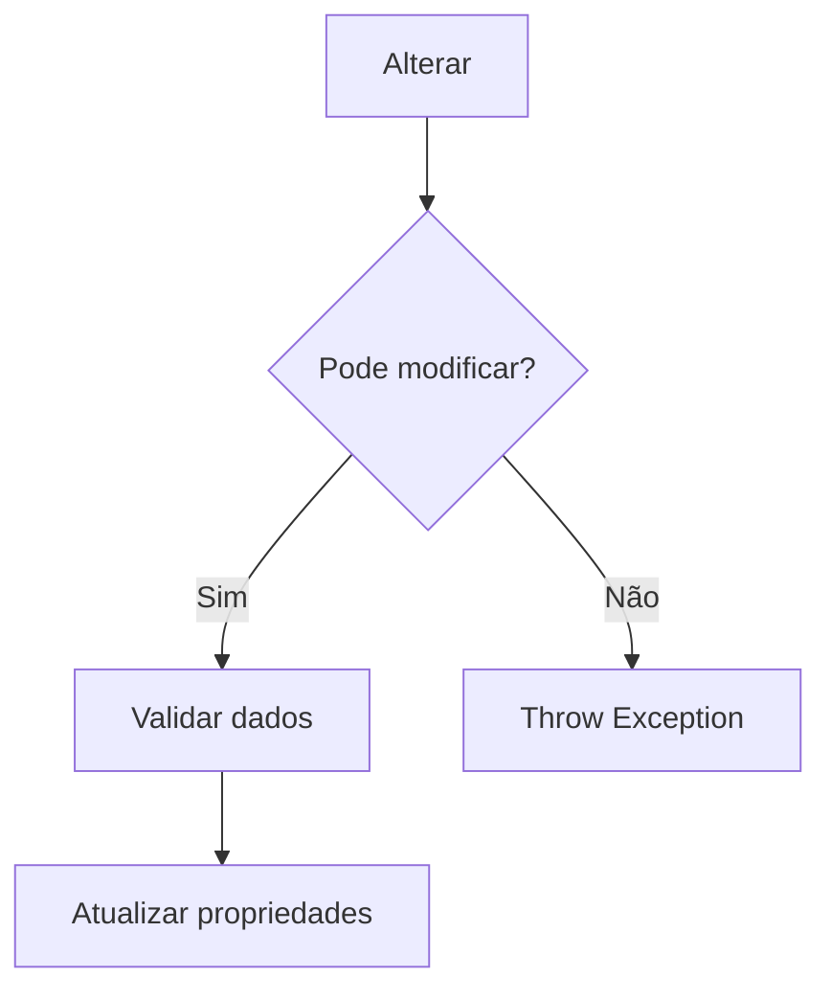
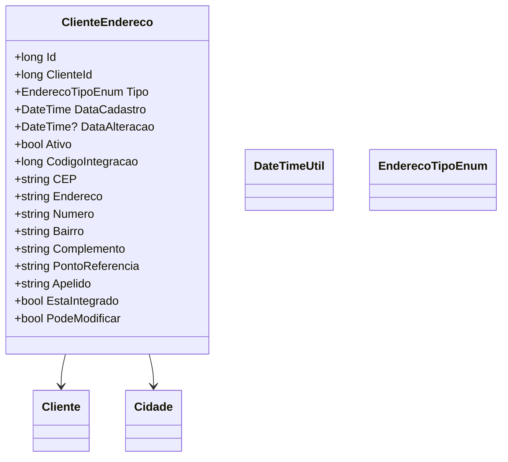

# ClienteEndereco
**Namespace**: IsthmusWinthor.Dominio.Entidades  
**Nome do Arquivo**: ClienteEndereco.cs  

## Visão Geral e Responsabilidade
A classe `ClienteEndereco` representa um endereço associado a um cliente no sistema. Sua principal responsabilidade é gerenciar a integridade dos dados de endereços e assegurar que as informações estejam sempre validadas e em conformidade com as regras de negócio definidas. Isso inclui o registro e atualização de endereços, envolvendo validações críticas que garantem a qualidade das informações, como a validação de CEP e cidade.

## Métodos de Negócio

### Inativar
- **Objetivo**: Desativar o endereço, marcando-o como não ativo.
- **Comportamento**: O método altera o status do endereço para inativo e atualiza a data de alteração para o momento atual.
- **Retorno**: Não retorna valor, apenas altera o estado do objeto.

### Ativar
- **Objetivo**: Reativar o endereço, se estava inativo.
- **Comportamento**: O método altera o estado do endereço para ativo e atualiza a data de alteração para o momento atual.
- **Retorno**: Não retorna valor, apenas altera o estado do objeto.

### Alterar
- **Objetivo**: Alterar as informações de endereço, desde que o endereço não tenha sido integrado a um pedido.
- **Comportamento**: 
  1. Verifica se o endereço pode ser modificado (não deve estar integrado).
  2. Se puder, valida os dados fornecidos (cidadeId, cep).
  3. Atualiza os campos do endereço e seta a data de alteração.
  
- **Retorno**: Não retorna valor, mas atualiza várias propriedades do objeto.

### AtualizarCodigoIntegracao
- **Objetivo**: Atualizar o código de integração do endereço.
- **Comportamento**: Define um novo valor para `CodigoIntegracao`, representando um novo link ou sincronização com um sistema externo.
- **Retorno**: Não retorna valor; apenas atualizado o estado interno da classe.

## Propriedades Calculadas e de Validação
### EstaIntegrado
- **Regra**: Retorna `true` se `CodigoIntegracao` for maior que zero, indicando que o endereço foi integrado a outros sistemas.

### PodeModificar
- **Regra**: Retorna `true` se o endereço não estiver integrado (`EstaIntegrado` é `false`), permitindo alterações.

## Navigations Property
- [Cliente](Cliente.md)
- [Cidade](Cidade.md)

## Tipos Auxiliares e Dependências
- [EnderecoTipoEnum](EnderecoTipoEnum.md)
- [DateTimeUtil](DateTimeUtil.md)

## Diagrama de Relacionamentos

