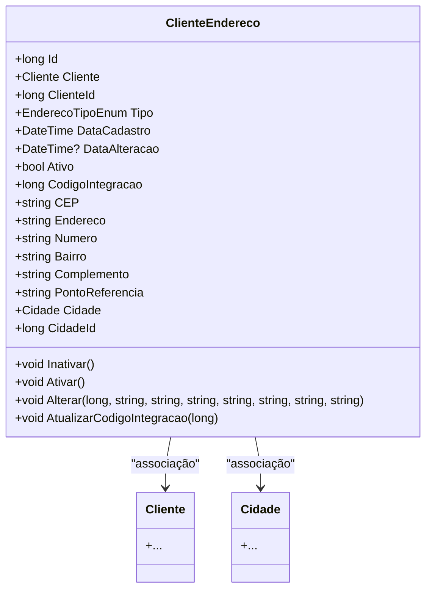

# ClienteEndereco
**Namespace**: IsthmusWinthor.Dominio.Entidades  
**Nome do Arquivo**: ClienteEndereco.cs  

## Visão Geral e Responsabilidade
A classe `ClienteEndereco` representa um endereço associado a um cliente no sistema, facilitando a gestão de informações essenciais sobre onde o cliente reside ou a entrega pode ser realizada. Essa classe é parte crucial da lógica de negócios, garantindo que os endereços sejam válidos e gerenciados corretamente, de acordo com regras predefinidas.

## Métodos de Negócio

### Inativar
- **Objetivo**: Garantir que o endereço do cliente seja marcado como inativo, preservando a integridade histórica dos dados.
- **Comportamento**: Este método altera o estado da propriedade `Ativo` para `false` e registra a data e hora da alteração em `DataAlteracao`.
- **Retorno**: Não retorna valor, mas altera o estado do objeto.

### Ativar
- **Objetivo**: Permitir a reativação de um endereço que havia sido previamente inativado.
- **Comportamento**: Muda a propriedade `Ativo` para `true` e atualiza a `DataAlteracao` com a data e hora atual.
- **Retorno**: Não retorna valor, mas altera o estado do objeto.

### Alterar
- **Objetivo**: Modificar os dados de um endereço existente, garantindo que apenas endereços não integrados possam ser alterados.
- **Comportamento**: Primeiro, valida os novos dados através do método `Validar`. Se o endereço já estiver integrado (`PodeModificar` é `false`), uma exceção é lançada. Se os dados forem válidos, todas as propriedades do endereço são atualizadas.
- **Retorno**: Não retorna valor, mas altera o estado do objeto.

### AtualizarCodigoIntegracao
- **Objetivo**: Atualizar o código de integração associado ao endereço.
- **Comportamento**: Atribui o valor fornecido à propriedade `CodigoIntegracao`.
- **Retorno**: Não retorna valor, mas altera o valor da propriedade.

## Propriedades Calculadas e de Validação

### EstaIntegrado
- **Regra**: Esta propriedade indica se o endereço possui um código de integração maior que zero. Se verdadeiro, significa que o endereço foi vinculado a um sistema externo, tornando-o uma entidade final em termos de modificações.

### PodeModificar
- **Regra**: Esta propriedade determina se o endereço pode ser modificado. Somente endereços não integrados podem ser alterados.

## Navigations Property
- [Cliente](Cliente.md)
- [Cidade](Cidade.md)

## Tipos Auxiliares e Dependências
- [EnderecoTipoEnum](EnderecoTipoEnum.md)
- [DateTimeUtil](DateTimeUtil.md)

## Diagrama de Relacionamentos

---
Gerada em 29/12/2025 20:20:48
