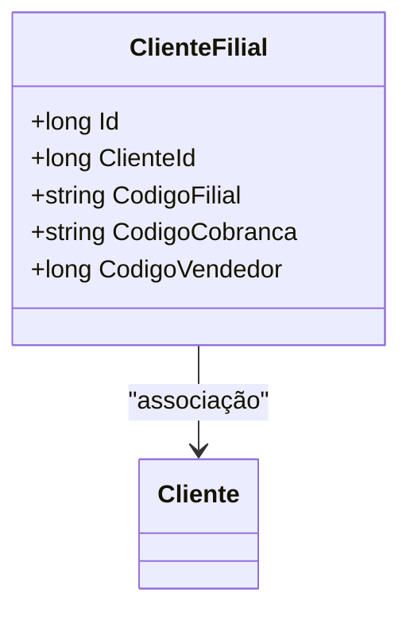

# ClienteFilial
**Namespace**: IsthmusWinthor.Dominio.Entidades  
**Nome do Arquivo**: ClienteFilial.cs  

## Visão Geral e Responsabilidade
A classe `ClienteFilial` representa uma entidade associada a um cliente em um contexto de filial. Seu papel é garantir a integridade das informações relacionadas a uma filial específica de um cliente, incluindo detalhes como códigos de filial e vendedor. Esta classe é essencial para modelar a hierarquia de um cliente e suas respectivas filiais no sistema.

## Métodos de Negócio
- **Título**: `void AdicionarFilial()`
  - **Objetivo**: Garante que a filial está sendo corretamente associada ao cliente, validando os dados essenciais que a caracterizam.
  - **Comportamento**: 
    1. Verifica se o `ClienteId` está vinculado a uma instância válida de `Cliente`.
    2. Confirma que os códigos de filial e cobrança são únicos e válidos.
    3. Armazena a filial associado ao cliente.
  - **Retorno**: Não retorna valor; confirma a realização da operação de associação.

## Propriedades Calculadas e de Validação
- Nenhuma propriedade contém lógica adicional no `get` ou validação no `set`.

## Navigation Property
- `[Cliente](Cliente.md)`: Representa a entidade `Cliente`, que é um objeto complexo do domínio associado a esta filial.
  
## Tipos Auxiliares e Dependências
- Nenhum enumerador ou classe estática/helper é utilizado diretamente pela classe `ClienteFilial`.

## Diagrama de Relacionamentos

