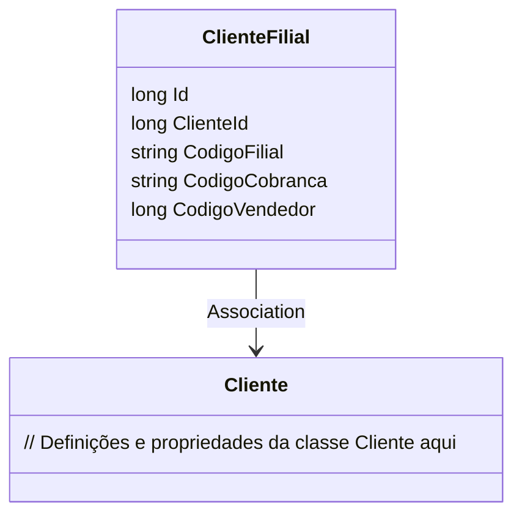

# ClienteFilial
**Namespace**: IsthmusWinthor.Dominio.Entidades  
**Nome do Arquivo**: ClienteFilial.cs  

## Visão Geral e Responsabilidade
A classe `ClienteFilial` representa uma entidade de domínio que relaciona uma filial a um cliente em um sistema corporativo. Essa classe é responsável por gerenciar informações específicas da filial, como códigos de identificação e informações sobre o vendedor responsável. A classe garante a integridade dos dados relacionados ao cliente e a filial, servindo como um ponto de referência para operações relacionadas a vendas e faturamento.

## Métodos de Negócio
A classe `ClienteFilial` não possui métodos de negócio com lógica complexa, sendo composta apenas por propriedades que funcionam como containers de dados.

## Propriedades Calculadas e de Validação
Não há propriedades que envolvem lógica de cálculo ou validação nesta classe.

## Navigation Property
- [Cliente](Cliente.md): A classe `Cliente` representa a entidade principal associada ao cliente da filial.

## Tipos Auxiliares e Dependências
Não há enumeradores ou classes estáticas/helpers utilizadas na classe `ClienteFilial`. 

## Diagrama de Relacionamentos

---
Gerada em 29/12/2025 20:20:54
