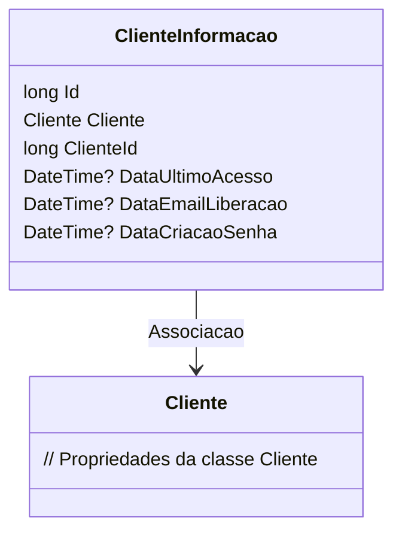

# ClienteInformacao
**Namespace**: IsthmusWinthor.Dominio.Entidades  
**Nome do Arquivo**: ClienteInformacao.cs

## Visão Geral e Responsabilidade
A classe `ClienteInformacao` representa informações adicionais relacionadas a um cliente no sistema. Ela atua como um container de dados, mantendo o estado e histórico de interações do cliente, como datas de acesso e criação de senha. Essa abordagem permite que a aplicação registre eventos relevantes para a gestão do cliente, além de facilitar o acesso a informações que podem ser utilizadas para análises e relatórios.

## Métodos de Negócio
* **Título**: (Nenhum método de negócio com lógica complexa encontrado na classe).  
  **Objetivo**: N/A  
  **Comportamento**: N/A  
  **Retorno**: N/A  

## Propriedades Calculadas e de Validação
Não foram encontradas propriedades com lógica de cálculo ou validação na classe `ClienteInformacao`.

## Navigation Property
- [Cliente](Cliente.md)

## Tipos Auxiliares e Dependências
Não foram encontrados Enumeradores ou Classes Estáticas/Helpers utilizadas pela classe `ClienteInformacao`.

## Diagrama de Relacionamentos

---
Gerada em 29/12/2025 20:21:01
