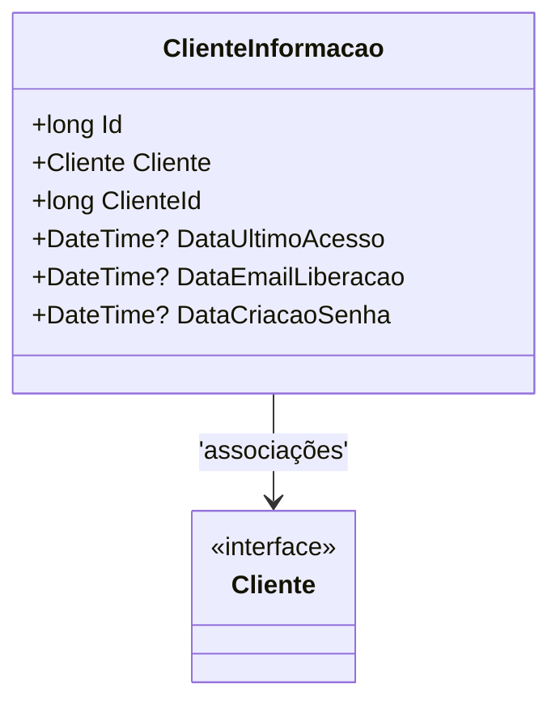

# ClienteInformacao
**Namespace**: IsthmusWinthor.Dominio.Entidades  
**Nome do Arquivo**: ClienteInformacao.cs  

## Visão Geral e Responsabilidade
A classe `ClienteInformacao` representa informações associadas a um cliente no domínio da aplicação. Ela armazena dados pertinentes ao histórico de interação do cliente, como as datas de último acesso e de criação de senha. Isso permite que o sistema tenha um controle eficaz sobre o uso e a segurança das informações do cliente, garantindo que ações de segurança, como redefinições de senha e monitoramento de acessos, possam ser gerenciadas de forma eficiente.

## Métodos de Negócio
_Nesta classe não foram identificados métodos de negócio, somente propriedades._

## Propriedades Calculadas e de Validação
- Não há propriedades com lógica de cálculo ou validação. Todas as propriedades são simples, com representações diretas de valores.

## Navigations Property
- `Cliente`: [Cliente](Cliente.md)  

## Tipos Auxiliares e Dependências
- Enumeradores e classes auxiliares não são utilizados nesta classe.

## Diagrama de Relacionamentos

