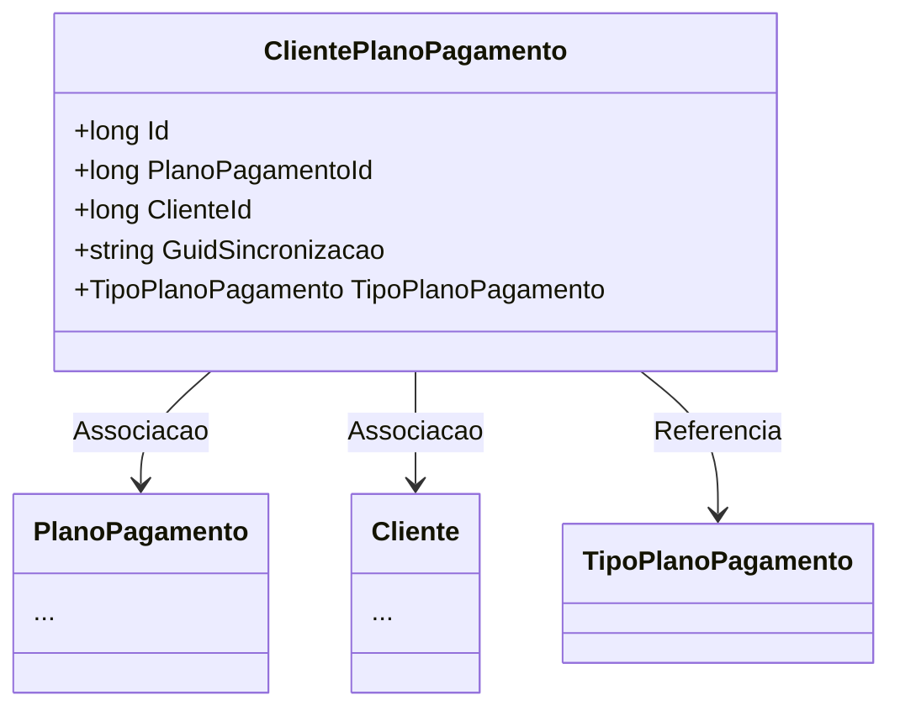

# ClientePlanoPagamento
- **Namespace**: IsthmusWinthor.Dominio.Entidades
- **Nome do Arquivo**: ClientePlanoPagamento.cs

## Visão Geral e Responsabilidade
A classe `ClientePlanoPagamento` representa a associação entre um cliente e um plano de pagamento. Ela é responsável por manter a integridade e a consistência dos dados relacionados a qual plano de pagamento um cliente está utilizando, além de fornecer informações adicionais, como o tipo de plano e um identificador único para sincronização. Essa classe resolve o problema de associar corretamente os clientes aos seus respectivos planos de pagamento e gerenciar a relação entre essas entidades.

## Métodos de Negócio
Nenhum método com lógica de negócio foi implementado na classe, apenas propriedades simples.

## Propriedades Calculadas e de Validação
Nenhuma propriedade com cálculo ou validação foi definida na classe.

## Navigation Property
- [PlanoPagamento](PlanoPagamento.md)
- [Cliente](Cliente.md)

## Tipos Auxiliares e Dependências
- [TipoPlanoPagamento](TipoPlanoPagamento.md)

## Diagrama de Relacionamentos

---
Gerada em 29/12/2025 20:21:09
