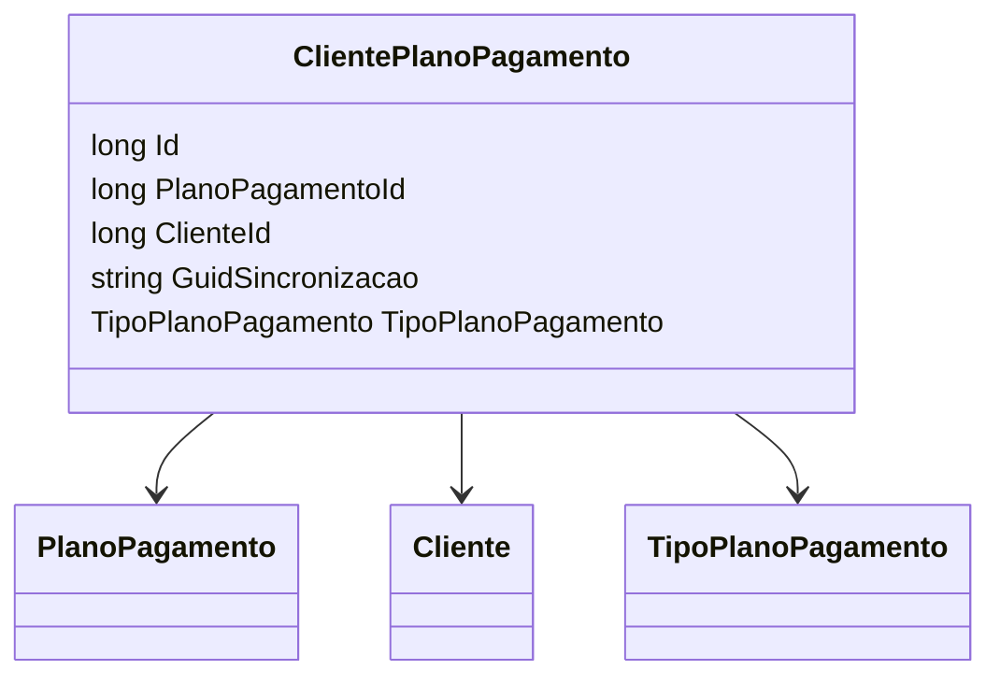

# ClientePlanoPagamento
**Namespace**: IsthmusWinthor.Dominio.Entidades  
**Nome do Arquivo**: ClientePlanoPagamento.cs  

## Visão Geral e Responsabilidade
A classe `ClientePlanoPagamento` representa a associação entre clientes e seus planos de pagamento. Este modelo é fundamental para a gestão financeira do sistema, permitindo ao sistema de pagamento identificar qual plano está vinculado a cada cliente e, portanto, gerenciar corretamente as transações e as configurações específicas de pagamento. O problema de negócio que essa classe resolve é a organização da relação entre múltiplos clientes e planos de pagamento, garantindo que os dados sejam integrados e acessíveis de maneira eficiente.

## Métodos de Negócio
(Nenhum método de lógica foi definido dentro da classe, somente propriedades foram declaradas.)

## Propriedades Calculadas e de Validação
(Não há propriedades com lógica no `get` ou validação no `set`.)

## Navigation Property
- [PlanoPagamento](PlanoPagamento.md)
- [Cliente](Cliente.md)

## Tipos Auxiliares e Dependências
- [TipoPlanoPagamento](TipoPlanoPagamento.md)

## Diagrama de Relacionamentos

