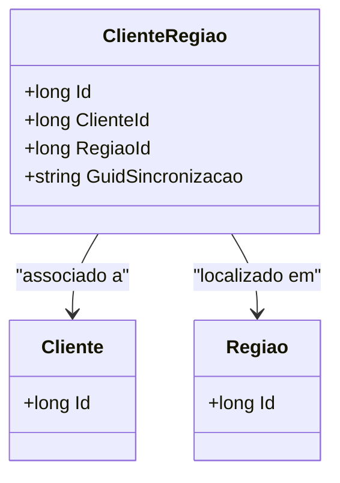

# ClienteRegiao
**Namespace**: IsthmusWinthor.Dominio.Entidades  
**Nome do Arquivo**: ClienteRegiao.cs  

## Visão Geral e Responsabilidade
A classe `ClienteRegiao` representa a relação entre um cliente e uma região em um sistema de domínio, permitindo associar um cliente específico a uma área geográfica. Essa associação é vital para a execução de estratégias de marketing, logística e vendas adaptadas a diferentes regiões, garantindo que o atendimento ao cliente e a entrega de serviços sejam otimizados conforme as particularidades locais.

## Métodos de Negócio
Esta classe não possui métodos de negócio complexos, servindo principalmente como uma entidade que representa a relação entre `Cliente` e `Regiao`.

## Propriedades Calculadas e de Validação
Esta classe não possui propriedades que implementem lógicas de cálculo ou validações.

## Navigations Property
- [Cliente](Cliente.md)
- [Regiao](Regiao.md)

## Tipos Auxiliares e Dependências
Esta classe não utiliza enumeradores ou classes auxiliares externas.

## Diagrama de Relacionamentos

---
Gerada em 29/12/2025 20:21:16
