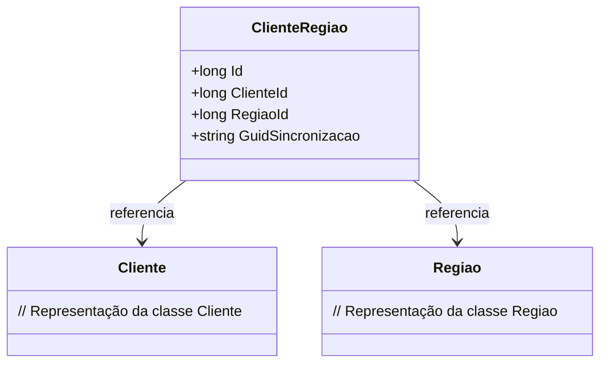

# ClienteRegiao
**Namespace**: IsthmusWinthor.Dominio.Entidades  
**Nome do Arquivo**: ClienteRegiao.cs  

## Visão Geral e Responsabilidade
A classe `ClienteRegiao` atua como uma entidade que representa a associação entre um cliente e uma região específica no contexto do sistema. Essa classe é fundamental para a organização de dados, permitindo que um cliente seja vinculado a uma ou mais regiões, o que é essencial em operações de negócio que dependem de geolocalização e segmentação regional de clientes.

## Métodos de Negócio
### N/A
- **Observação**: A classe `ClienteRegiao` não apresenta métodos de negócio com lógica significativa, mas pode ser ampliada com operações relevantes para a manipulação de clientes e suas regiões.

## Propriedades Calculadas e de Validação
### N/A
- **Observação**: Esta classe não contém propriedades que realizam cálculos ou validações diretas.

## Navigations Property
- `[Cliente](Cliente.md)` - Representa a classe que encapsula as informações do cliente.
- `[Regiao](Regiao.md)` - Representa a classe que encapsula as informações da região.

## Tipos Auxiliares e Dependências
- N/A
- **Observação**: Esta classe não possui dependências com enumeradores ou classes auxiliares.

## Diagrama de Relacionamentos

