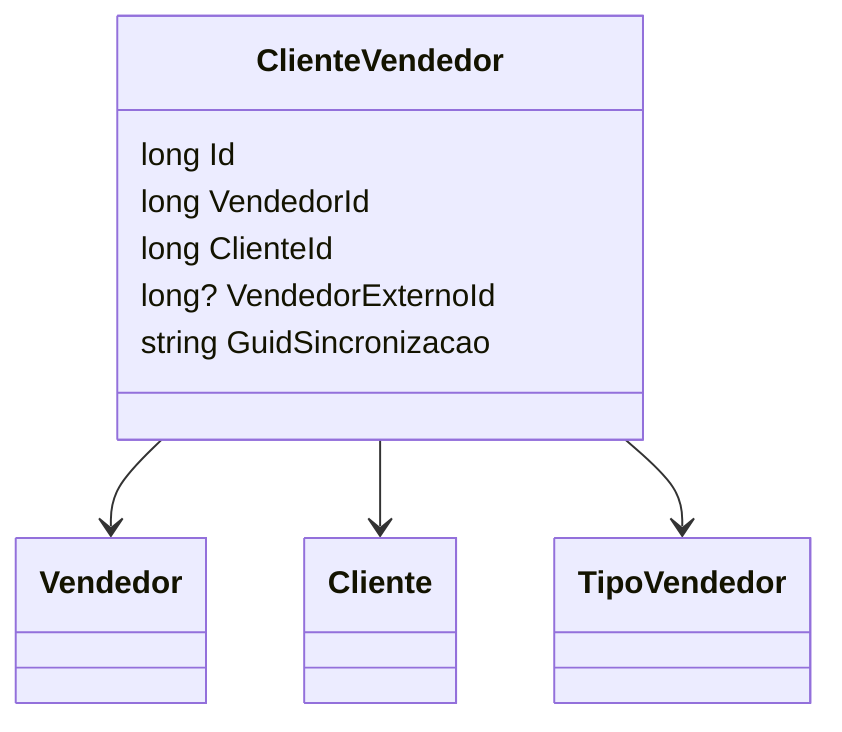

# ClienteVendedor
**Namespace**: IsthmusWinthor.Dominio.Entidades  
**Nome do Arquivo**: ClienteVendedor.cs  

## Visão Geral e Responsabilidade
A classe `ClienteVendedor` representa a associação entre um vendedor e um cliente dentro do sistema. Essa classe é responsável por gerenciar as relações entre entidades de vendedor e cliente, permitindo a definição do tipo de vendedor e facilitando a sincronização de dados necessários para operações comerciais. O problema de negócio que ela resolve é a necessidade de vincular um cliente a um vendedor específico, considerando também aspectos de venda externa, promovendo um acesso controlado e sequencial aos dados que interagem entre vendas e clientes.

## Métodos de Negócio
- **Título**: (não possui métodos com lógica complexa para detalhamento)

## Propriedades Calculadas e de Validação
- **TipoVendedor**: Esta propriedade define o tipo de vendedor associado ao cliente, que pode afetar diretamente as condições e regras que regem a interação de vendas. O sistema pode ter diferentes comportamentos ou validações com base nesse tipo.

## Navigation Properties
- [`Vendedor`](Vendedor.md) - Representa a entidade que realiza a venda.
- [`Cliente`](Cliente.md) - Representa a entidade que recebe o serviço ou produto.

## Tipos Auxiliares e Dependências
- [`TipoVendedor`](TipoVendedor.md) - Enum que caracteriza os diversos tipos de vendedores existentes no sistema.

## Diagrama de Relacionamentos

