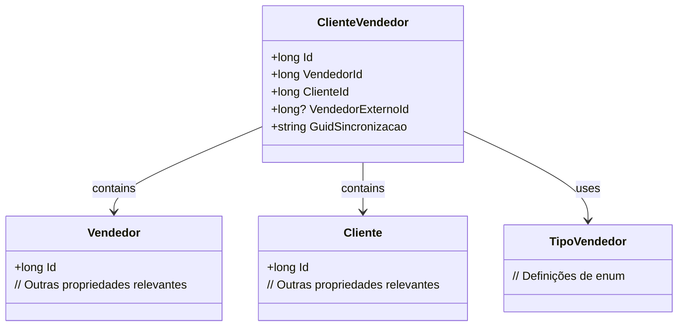

# ClienteVendedor
**Namespace**: IsthmusWinthor.Dominio.Entidades  
**Nome do Arquivo**: ClienteVendedor.cs  

## Visão Geral e Responsabilidade
A classe `ClienteVendedor` representa a relação entre um vendedor e um cliente no contexto de uma plataforma de vendas. Essa classe é fundamental para gerenciar as associações entre vendedores e clientes, que são essenciais para a execução de estratégias de vendas e marketing. Sua responsabilidade principal é assegurar que cada cliente esteja vinculado a um vendedor específico, que pode ser um vendedor interno ou externo, e ajudar a rastrear a sincronia de dados entre sistemas.

## Métodos de Negócio
Não existem métodos com lógica em `ClienteVendedor`, pois todos os comportamentos e regras de negócio são tratados na interação de suas propriedades.

## Propriedades Calculadas e de Validação
N/A

## Navigation Property
- [Vendedor](Vendedor.md)
- [Cliente](Cliente.md)

## Tipos Auxiliares e Dependências
- [TipoVendedor](TipoVendedor.md)

## Diagrama de Relacionamentos

---
Gerada em 29/12/2025 20:21:23
