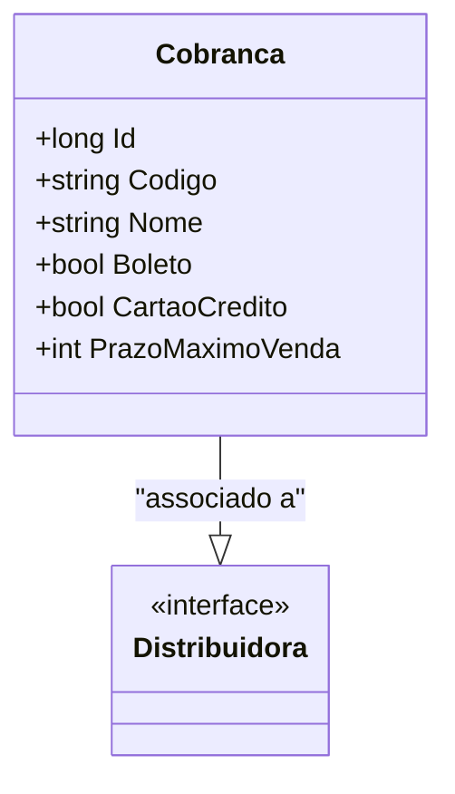

# Cobranca
- **Namespace**: IsthmusWinthor.Dominio.Entidades
- **Nome do Arquivo**: Cobranca.cs

## Visão Geral e Responsabilidade
A classe `Cobranca` é responsável por modelar as informações relacionadas aos métodos de cobrança disponíveis no sistema. Ela permite a configuração de diferentes formas de pagamento, como boleto e cartão de crédito, além de estabelecer um prazo máximo para a realização das vendas. Com essas informações, a classe assegura que as regras comerciais de cobrança sejam aplicadas corretamente, permitindo que o sistema gerencie eficientemente as operações financeiras.

## Métodos de Negócio
Atualmente, a classe `Cobranca` não possui métodos com lógica de negócios complexa, portanto, não há métodos a serem documentados nesta seção.

## Propriedades Calculadas e de Validação
- **PrazoMaximoVenda**: Este campo deve refletir o número máximo de dias permitido para a realização de uma venda. A classe atualmente não implementa lógica de validação no `set`, mas é importante garantir que o valor esteja dentro de limites razoáveis de negócio (ex: não pode ser negativo).

## Navigation Properties
- [Distribuidora](Distribuidora.md): Representa a distribuidora associada à cobrança.

## Tipos Auxiliares e Dependências
Não há enumeradores ou classes auxiliares mencionadas diretamente na classe `Cobranca`.

## Diagrama de Relacionamentos

---
Gerada em 29/12/2025 20:21:31
