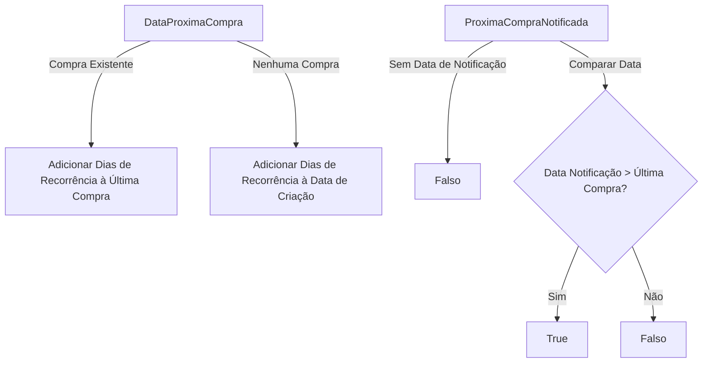
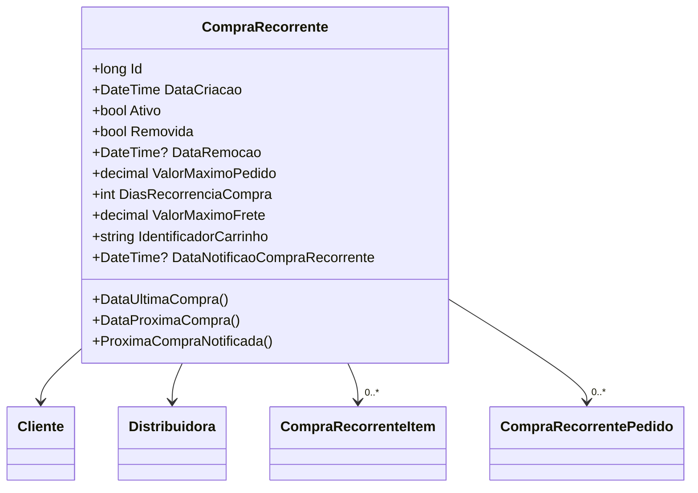

# CompraRecorrente

**Namespace**: IsthmusWinthor.Dominio.Entidades  
**Nome do Arquivo**: CompraRecorrente.cs  

## Visão Geral e Responsabilidade
A classe `CompraRecorrente` representa um modelo de negócio que gerencia a lógica de compras recorrentes de um cliente em uma distribuidora. Esta classe é responsável por garantir que as compras sejam realizadas de forma automatizada e conforme a recorrência definida, considerando a gestão de notificações, limites de valor e controle de estado da compra.

## Métodos de Negócio

### 1. DataUltimaCompra: Visibilidade Pública
- **Objetivo**: Este método calcula a data da última compra executada pelo cliente ou a última compra de controle, se houver.
- **Comportamento**: O método filtra os pedidos de compras recorrentes para encontrar os que foram executados ou são de controle, ordena esses registros pela data da compra em ordem decrescente e retorna a data da última compra ou `DateTime.MinValue`, caso não existam compras válidas.
- **Retorno**: Retorna a data da última compra ou `DateTime.MinValue` se não houver compras.

### 2. DataProximaCompra: Visibilidade Pública
- **Objetivo**: Este método determina a data da próxima compra recorrente a ser realizada, com base na configuração de dias de recorrência e na data da última compra.
- **Comportamento**: O método verifica a data da última compra. Se uma compra ocorreu, ele adiciona os dias de recorrência à última compra. Caso contrário, adiciona os dias de recorrência à data de criação da compra recorrente.
- **Retorno**: Retorna a data da próxima compra a ser realizada.

### 3. ProximaCompraNotificada: Visibilidade Pública
- **Objetivo**: Este método indica se a próxima compra já foi notificada ao cliente.
- **Comportamento**: O método verifica se a data da notificação da próxima compra é posterior à última data de compra executada. Se não houver data de notificação, retorna `false`. Caso contrário, compara a data de notificação com a última data de compra para determinar a notificação.
- **Retorno**: Retorna `true` se a próxima compra foi notificada, ou `false` caso contrário.

## Propriedades Calculadas e de Validação
- **DataUltimaCompra**: Calcula a data da última compra realizada com base nos pedidos associados.
- **DataProximaCompra**: Calcula a data da próxima compra baseada na última compra ou na data de criação.
- **ProximaCompraNotificada**: Verifica se a próxima compra foi notificada ao cliente, considerando a data de notificação e a última compra.

## Navigations Property
- [Cliente](Cliente.md)
- [Distribuidora](Distribuidora.md)
- [CompraRecorrenteItem](CompraRecorrenteItem.md)
- [CompraRecorrentePedido](CompraRecorrentePedido.md)

## Tipos Auxiliares e Dependências
- [TipoEnum](TipoEnum.md)

## Diagrama de Relacionamentos

---
Gerada em 29/12/2025 20:21:52
