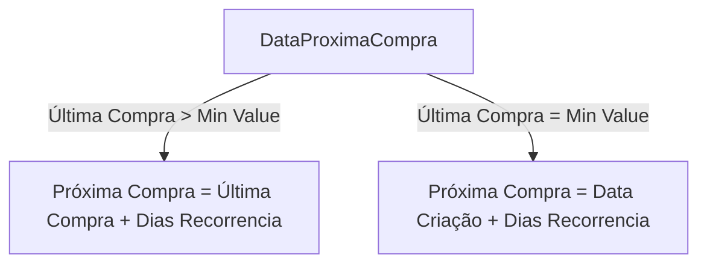
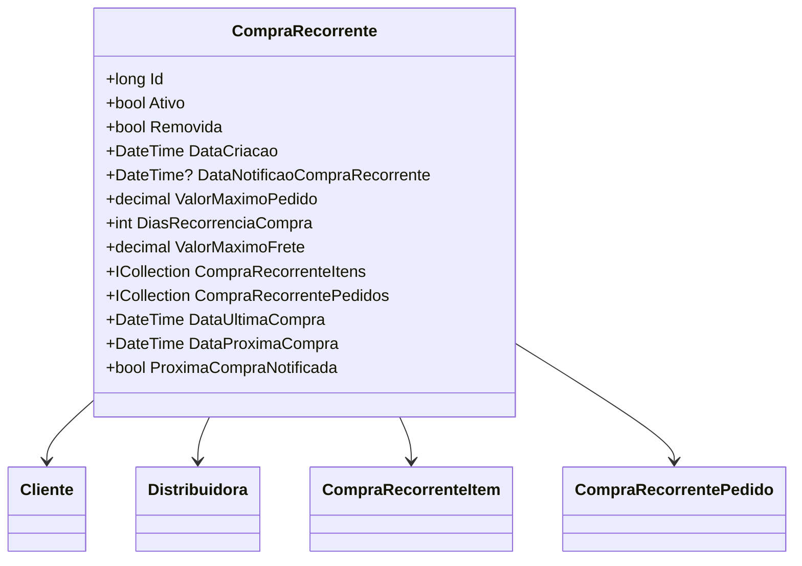

# CompraRecorrente
**Namespace**: IsthmusWinthor.Dominio.Entidades  
**Nome do Arquivo**: CompraRecorrente.cs  

## Visão Geral e Responsabilidade
A classe `CompraRecorrente` representa um modelo de domínio que gerencia compras recorrentes de clientes em um sistema de vendas. Essa classe possibilita a criação e o monitoramento de compras automáticas, garantindo que as transações ocorram de forma regular e de acordo com as regras de negócio definidas. Isso resolve o problema de automação de compras, aumentando a comodidade do cliente e melhorando a eficiência operacional da distribuidora.

## Métodos de Negócio

### 1. Título: DataUltimaCompra (Visibilidade: público)
- **Objetivo**: Garante que sempre que a última compra realizada é identificável, permitindo um calculo preciso da próxima compra.
- **Comportamento**: 
  - Filtra a coleção `CompraRecorrentePedidos` para encontrar pedidos que foram executados ou são de controle.
  - Ordena esses pedidos pela data da compra em ordem decrescente.
  - Seleciona a primeira compra (a mais recente) e retorna a sua data ou `DateTime.MinValue` se não houver compras realizadas.
- **Retorno**: Um `DateTime` que representa a data da última compra, ou `DateTime.MinValue` caso não haja compras.

### 2. Título: DataProximaCompra (Visibilidade: público)
- **Objetivo**: Calcula a data da próxima compra, garantindo que o cliente seja notificado no tempo correto.
- **Comportamento**: 
  - Recupera a data da última compra usando o método `DataUltimaCompra`.
  - Se a data da última compra for maior que `DateTime.MinValue`, adiciona `DiasRecorrenciaCompra` a esta data para determinar a próxima compra.
  - Caso contrário, adiciona `DiasRecorrenciaCompra` à data de criação da compra.
- **Retorno**: Um `DateTime` que representa a data da próxima compra, baseado na lógica descrita.

### 3. Título: ProximaCompraNotificada (Visibilidade: público)
- **Objetivo**: Determina se o cliente já foi notificado sobre a próxima compra que será realizada.
- **Comportamento**: 
  - Checa se `DataNotificaoCompraRecorrente` possui um valor.
  - Se não possui valor, retorna `false`.
  - Caso tenha valor, busca a última compra da coleção `CompraRecorrentePedidos`.
  - Compara a data da notificação com a última data de compra executada. Se a notificação foi feita após a última tentativa de compra, retorna `true`, indicando que o cliente foi notificado.
- **Retorno**: Um `bool`, `true` se a próxima compra já foi notificada, e `false` caso contrário.

## Propriedades Calculadas e de Validação

### Propriedades
- **DataUltimaCompra**: Calcula a última data de compra com base em pedidos executados ou de controle.
- **DataProximaCompra**: Calcula a próxima data de compra em relação à última compra ou à data de criação.
- **ProximaCompraNotificada**: Verifica se a notificação sobre a próxima compra já foi realizada ao cliente.

## Navigations Property
- `[Cliente](Cliente.md)`
- `[Distribuidora](Distribuidora.md)`
- `[CompraRecorrenteItem](CompraRecorrenteItem.md)`
- `[CompraRecorrentePedido](CompraRecorrentePedido.md)`

## Tipos Auxiliares e Dependências
- Enum: `[StatusCompra](StatusCompra.md)`

## Diagrama de Relacionamentos

