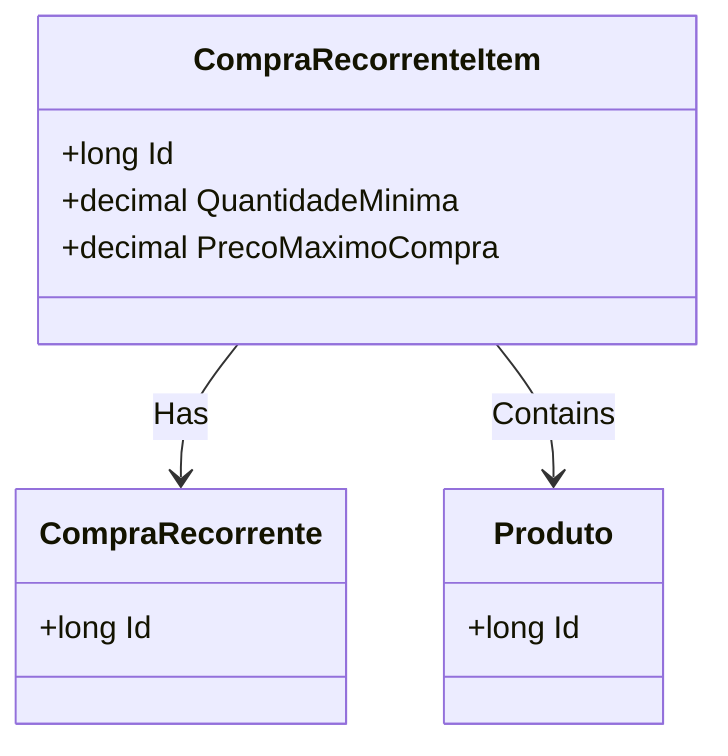

# CompraRecorrenteItem
**Namespace**: IsthmusWinthor.Dominio.Entidades  
**Nome do Arquivo**: CompraRecorrenteItem.cs  

## Visão Geral e Responsabilidade
A classe `CompraRecorrenteItem` representa um item em uma compra recorrente dentro do sistema. Sua principal responsabilidade é modelar a relação entre um produto e uma compra recorrente, garantindo que os detalhes do item, como quantidade mínima e preço máximo, sejam respeitados. Isso permite que o sistema gerencie compras que ocorrem em intervalos regulares de forma eficiente e controlada.

## Métodos de Negócio
*Nota: Não foram encontrados métodos com lógica no código fornecido. A classe é composta principalmente por propriedades que armazenam dados relacionados a um item de compra recorrente.*

## Propriedades Calculadas e de Validação
- **QuantidadeMinima**: Esta propriedade representa a quantidade mínima de um produto que deve ser comprada em cada transação recorrente. A regra de negócio é garantir que essa quantidade seja sempre atendida, influenciando a decisão de compra durante o processamento da compra recorrente.
- **PrecoMaximoCompra**: Esta propriedade define o preço máximo que pode ser pago por um produto durante a compra recorrente. A regra de negócio assegura que, ao realizar a compra, o preço não ultrapasse esse limite, prevenindo compras indesejadas quando os preços de mercado aumentam.

## Navigations Property
- `[CompraRecorrente](CompraRecorrente.md)`: Classe que representa a compra recorrente associada a este item.
- `[Produto](Produto.md)`: Classe que representa o produto associado a este item.

## Tipos Auxiliares e Dependências
- Nenhum enumerador ou classe auxiliar foi identificado como utilizado diretamente nesta classe.

## Diagrama de Relacionamentos

