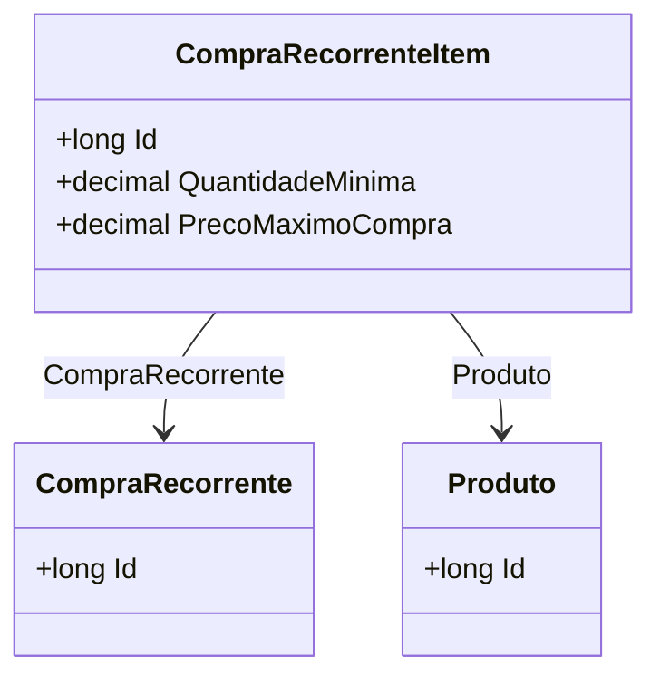

# CompraRecorrenteItem
**Namespace**: IsthmusWinthor.Dominio.Entidades  
**Nome do Arquivo**: CompraRecorrenteItem.cs  

## Visão Geral e Responsabilidade
A classe `CompraRecorrenteItem` representa um item dentro de uma compra recorrente no sistema. Ela é responsável por manter os dados específicos de cada item, como a quantidade mínima a ser comprada e o preço máximo da compra, garantindo que as compras recorrentes sejam realizadas dentro de limites definidos. Essa classe resolve o problema de gerenciamento adequado de compras recorrentes ao permitir que os usuários definam parâmetros para cada item em sua compra.

## Métodos de Negócio
Os métodos relevantes nesta classe não foram implementados, já que a classe contém apenas propriedades que armazenam dados. Portanto, não existem métodos de negócio que garantam regras específicas neste contexto.

## Propriedades Calculadas e de Validação
- Não foram identificadas propriedades com lógica complexa no `get` ou validações específicas no `set` nesta classe.

## Navigation Property
- [CompraRecorrente](CompraRecorrente.md): Representa a compra recorrente associada a este item.
- [Produto](Produto.md): Representa o produto vinculado a este item de compra.

## Tipos Auxiliares e Dependências
- Nenhum tipo auxiliar, enumerador ou classe estática foi identificado como utilizado por esta classe.

## Diagrama de Relacionamentos

---
Gerada em 29/12/2025 20:22:01
