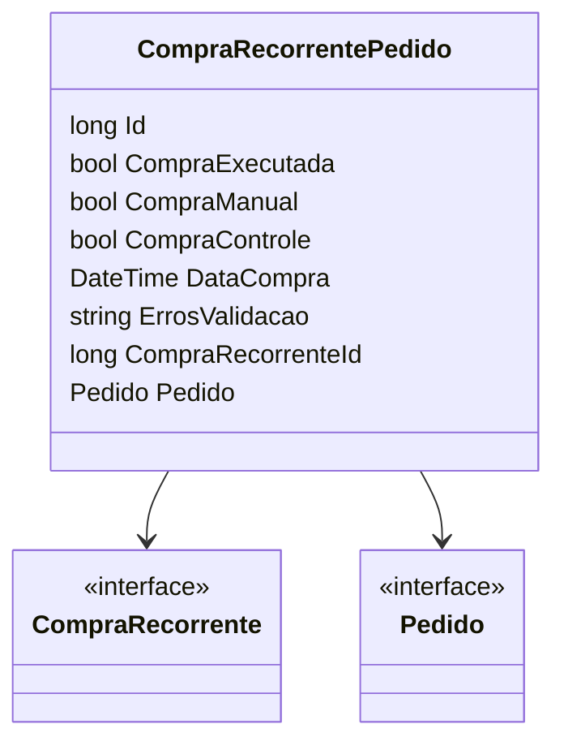

# CompraRecorrentePedido
**Namespace**: IsthmusWinthor.Dominio.Entidades  
**Nome do Arquivo**: CompraRecorrentePedido.cs  

## Visão Geral e Responsabilidade
A classe `CompraRecorrentePedido` representa um registro de pedidos gerados a partir de uma compra recorrente no sistema. Ela desempenha o papel de gerenciar a relação entre uma compra recorrente e um pedido, assegurando que as regras de negócio relacionadas à execução de compras e vinculação de pedidos sejam mantidas. A implementação lida com a complexidade de compras manuais e automáticas, além de permitir a manipulação de erros de validação, proporcionando robustez ao fluxo de compra.

## Métodos de Negócio
Atualmente, a classe fornecida não apresenta métodos de negócio complexos que envolvam lógica significativa. O foco está principalmente nas propriedades que definem o estado da compra recorrente e suas interações.

## Propriedades Calculadas e de Validação
- `CompraExecutada`: Esta propriedade indica se a compra foi efetivamente realizada. A lógica por trás dessa propriedade é crucial para determinar se um pedido deve ser considerado como efetuado ou não.
- `CompraControle`: Se definida como `true`, indica que a compra é um evento de controle. Essa propriedade não gera um pedido e assegura que o campo `CompraExecutada` permaneça como `false`, servindo para funcionalidades relacionadas ao gerenciamento da próxima data de compra.

## Navigations Property
- [CompraRecorrente](CompraRecorrente.md): Representa a compra recorrente associada a este pedido.
- [Pedido](Pedido.md): Representa o pedido gerado a partir da compra recorrente.

## Tipos Auxiliares e Dependências
Nenhum enumerador ou classe estática/Helper é utilizado nesta classe até o momento.

## Diagrama de Relacionamentos

Esta documentação foi elaborada para refletir o entendimento atual da classe `CompraRecorrentePedido` e suas responsabilidades no contexto de gerenciamento de compras recorrentes no sistema.
---
Gerada em 29/12/2025 20:22:11
