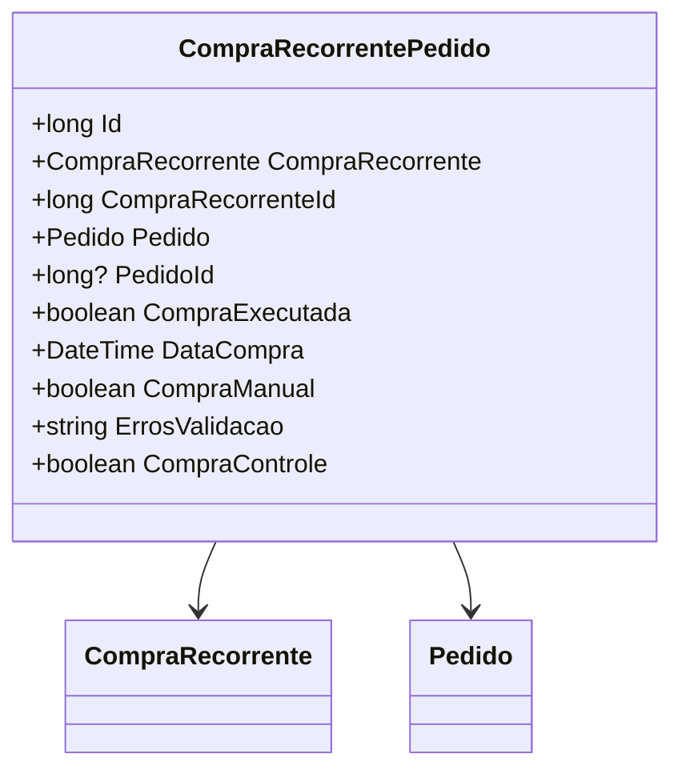

# CompraRecorrentePedido
**Namespace**: IsthmusWinthor.Dominio.Entidades  
**Nome do Arquivo**: CompraRecorrentePedido.cs

## Visão Geral e Responsabilidade
A classe `CompraRecorrentePedido` representa um pedido ligado a uma compra recorrente no sistema. Ela atua como a raiz de agregado, gerenciando as informações relacionadas a um pedido que pode ser associado a um ciclo de compras automáticas. O objetivo dela é garantir que as compras recorrentes sejam corretamente registradas e que suas propriedades estejam em conformidade com as regras de negócio, como o controle de execução de compras e o registro de possíveis erros de validação.

## Métodos de Negócio
(Nenhum método com lógica foi encontrado na classe fornecida, portanto, esta seção não se aplica).

## Propriedades Calculadas e de Validação
- **ErrosValidacao**: Armazena erros de validação encontrados ao processar a compra. A regra é que esta propriedade deve ser populada sempre que restrições específicas de validação não forem atendidas, garantindo que o estado da compra possa ser auditado em caso de falhas.

## Navigations Property
- [`CompraRecorrente`](CompraRecorrente.md): Representa a compra recorrente associada a este pedido.
- [`Pedido`](Pedido.md): Representa o pedido associado à compra recorrente.

## Tipos Auxiliares e Dependências
- Não há enumeradores ou classes auxiliares diretamente vinculadas à classe `CompraRecorrentePedido`.

## Diagrama de Relacionamentos

