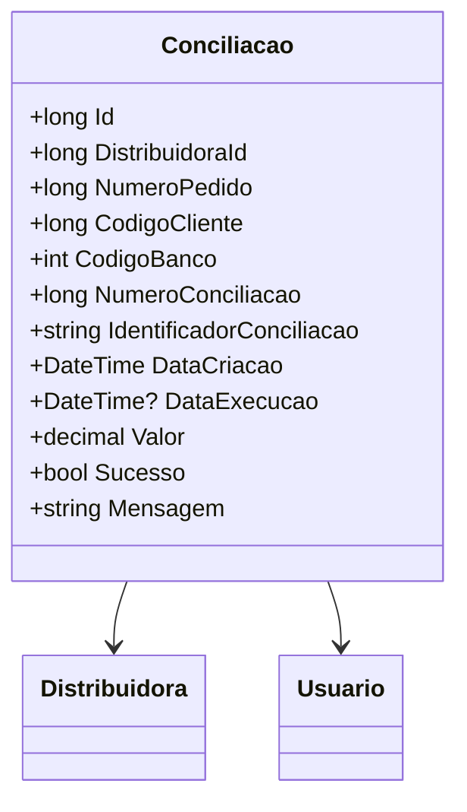

# Conciliacao

- **Namespace**: IsthmusWinthor.Dominio.Entidades
- **Nome do Arquivo**: Conciliacao.cs

## Visão Geral e Responsabilidade
A classe `Conciliacao` representa o processo de conciliação financeira em um sistema de gestão, conectando pedidos e pagamentos de clientes a uma distribuidora específica. Ela garante a correta associação de pagamentos recebidos com pedidos, permitindo a visualização e operação de crédito e débito de valores. A conciliação é uma etapa essencial para a verificação e controle dos registros financeiros da empresa, garantindo que os valores conciliados correspondam às transações esperadas.

## Métodos de Negócio

### Construtor: Conciliacao(PagamentoContaPix pagamentoContaPix)
- **Objetivo**: Inicializa uma nova instância de `Conciliacao` a partir de um objeto `PagamentoContaPix`, preenchendo os campos necessários com as informações derivadas do pagamento.
- **Comportamento**:
  1. Obtém e atribui o `DistribuidoraId` do `PagamentoContaPix`.
  2. Extrai e estabelece o `NumeroPedido` associado ao pagamento.
  3. Captura o `CodigoCliente` que realizou o pagamento.
  4. Adquire o `CodigoBanco` referente ao pagamento.
  5. Gera um identificador único para a conciliação utilizando `Guid`.
  6. Define a `DataCriacao` com a data e hora atuais.
  7. Atribui o valor pago à propriedade `Valor`.
- **Retorno**: Não retorna valor, mas instancia um objeto `Conciliacao` totalmente preenchido.

### Construtor: Conciliacao(DevolucaoPagamentoContaPix devolucaoPagamentoConta)
- **Objetivo**: Cria uma nova instância de `Conciliacao` a partir de uma devolução de pagamento, processando os dados necessários.
- **Comportamento**:
  1. Atribui o `DistribuidoraId` da `DevolucaoPagamentoContaPix`.
  2. Determina o `NumeroPedido` do pagamento devolvido.
  3. Obtém o `CodigoCliente` associado ao pedido.
  4. Captura o `CodigoBanco` relativo ao pagamento.
  5. Gera um identificador único para a devolução.
  6. Registra a `DataCriacao` com a data e hora atuais.
  7. Estabelece o `Valor` como o valor da devolução multiplicado por -1, indicando que é um débito.
- **Retorno**: Não retorna valor, mas cria um objeto `Conciliacao` configurado para refletir uma devolução.

## Propriedades Calculadas e de Validação
- Não há propriedades que contenham lógica extra no `get` ou validações no `set`.

## Navigations Property
- [Distribuidora](Distribuidora.md)
- [Usuario](Usuario.md)

## Tipos Auxiliares e Dependências
- [PagamentoContaPix](PagamentoContaPix.md)
- [DevolucaoPagamentoContaPix](DevolucaoPagamentoContaPix.md)
- [DateTimeUtil](DateTimeUtil.md)

## Diagrama de Relacionamentos

---
Gerada em 29/12/2025 20:22:35
