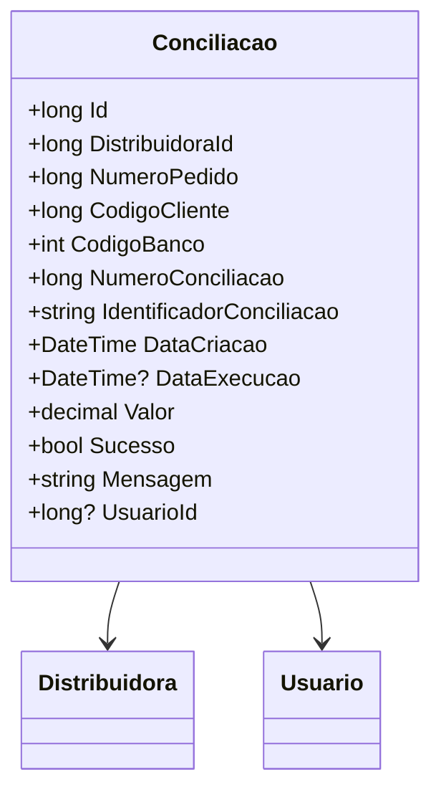

# Conciliacao
**Namespace**: IsthmusWinthor.Dominio.Entidades  
**Nome do Arquivo**: Conciliacao.cs  

## Visão Geral e Responsabilidade
A classe `Conciliacao` representa o modelo de domínio responsável por gerenciar as informações de conciliação de pagamentos. Seu objetivo é garantir que as operações financeiras, como créditos e débitos, sejam registradas adequadamente, permitindo a rastreabilidade dos pagamentos realizados pelos clientes. Esta classe é fundamental para validar e processar as informações recebidas do ERP e garantir que os dados de conciliação estejam sempre consistentes.

## Métodos de Negócio

### Título: Construtor `Conciliacao(PagamentoContaPix)`
- **Objetivo**: Inicializa uma nova instância de `Conciliacao` com os dados de um pagamento realizado via Conta Pix, garantindo que os campos obrigatórios sejam preenchidos corretamente.
- **Comportamento**: 
  1. Extraí informações do objeto `PagamentoContaPix`.
  2. Atribui o `DistribuidoraId`, `NumeroPedido`, `CodigoCliente` e `CodigoBanco` com base nas propriedades do pagamento.
  3. Gera um `IdentificadorConciliacao` único usando `Guid.NewGuid()`.
  4. Define a `DataCriacao` como a data atual usando `DateTimeUtil.Now`.
  5. Atribui o `Valor` do pagamento diretamente.
- **Retorno**: Não há valor de retorno; este construtor inicializa a instância da classe.

### Título: Construtor `Conciliacao(DevolucaoPagamentoContaPix)`
- **Objetivo**: Inicializa uma nova instância de `Conciliacao` com dados de uma devolução de pagamento via Conta Pix, assegurando que os valores adequados sejam ajustados.
- **Comportamento**:
  1. Extrai informações do objeto `DevolucaoPagamentoContaPix`.
  2. Atribui o `DistribuidoraId`, `NumeroPedido` e `CodigoCliente` semelhante ao construtor anterior.
  3. Gera um `IdentificadorConciliacao` único com `Guid.NewGuid()`.
  4. Define a `DataCriacao` utilizando `DateTimeUtil.Now`.
  5. Atribui o `Valor` da devolução como um valor negativo.
- **Retorno**: Não há valor de retorno; o construtor finaliza a configuração da instância.

## Propriedades Calculadas e de Validação
- Nenhuma propriedade possui lógica de cálculo ou validação no `get` ou `set`.

## Navigation Properties
- [`Distribuidora`](Distribuidora.md)
- [`Usuario`](Usuario.md)

## Tipos Auxiliares e Dependências
- [PagamentoContaPix](PagamentoContaPix.md)
- [DevolucaoPagamentoContaPix](DevolucaoPagamentoContaPix.md)
- [Usuario](Usuario.md)

## Diagrama de Relacionamentos

