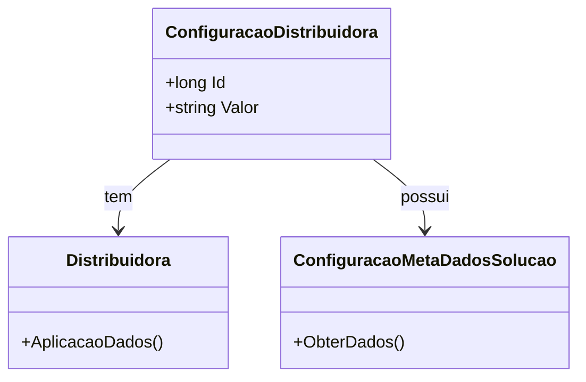

# ConfiguracaoDistribuidora
- **Namespace**: IsthmusWinthor.Dominio.Entidades
- **Nome do Arquivo**: ConfiguracaoDistribuidora.cs

## Visão Geral e Responsabilidade
A classe `ConfiguracaoDistribuidora` representa uma configuração específica associada a uma distribuidora. O principal objetivo dessa classe é armazenar informações de configuração relevantes que podem afetar o comportamento e a operação de uma distribuidora, possibilitando que os sistemas que dependem dessas informações funcionem de maneira adequada e eficiente.

## Navegação de Propriedades
- [Distribuidora](Distribuidora.md)
- [ConfiguracaoMetaDadosSolucao](ConfiguracaoMetaDadosSolucao.md)

## Tipos Auxiliares e Dependências
- **Enums**: Nenhum enumerador é utilizado diretamente nesta classe.
- **Classes Estáticas/Helpers**: Nenhuma classe estática ou helper é utilizada diretamente nesta classe.

## Diagrama de Relacionamentos

### Observações Finais
A classe `ConfiguracaoDistribuidora` é fundamental para garantir que informações cruciais referentes às distribuidoras sejam adequadamente gerenciadas, assegurando a integridade de dados e permitindo a personalização das operações da distribuidora conforme necessário.
---
Gerada em 29/12/2025 20:22:42
