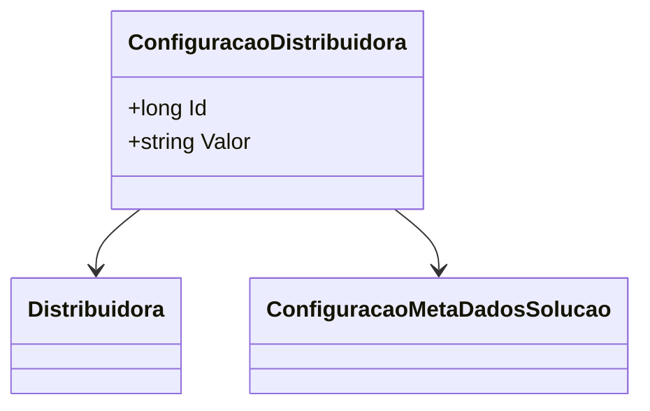

# ConfiguracaoDistribuidora
**Namespace**: IsthmusWinthor.Dominio.Entidades  
**Nome do Arquivo**: ConfiguracaoDistribuidora.cs

## Visão Geral e Responsabilidade
A classe `ConfiguracaoDistribuidora` representa uma configuração associada a uma distribuidora específica no sistema. Sua principal responsabilidade é armazenar e gerenciar os parâmetros de configuração que permitem a personalização do comportamento das distribuidoras, permitindo que a lógica de negócios interaja com essas configurações de forma adequada. Esta classe responde à necessidade de vincular dados de configuração a uma distribuidora e possibilitar a gestão eficiente das operações comerciais.

## Métodos de Negócio
*[Não existem métodos com lógica de negócios nesta classe.]*

## Propriedades Calculadas e de Validação
- **Valor**
  - Regra: A propriedade `Valor` não possui lógica adicional no acesso, mas ele serve como uma forma de armazenar o valor configurável da distribuidora.

## Navigation Property
- `[Distribuidora](Distribuidora.md)`: Representa a distribuidora associada a esta configuração.
- `[ConfiguracaoMetaDadosSolucao](ConfiguracaoMetaDadosSolucao.md)`: Representa a metadados relacionados à solução da configuração.

## Tipos Auxiliares e Dependências
- `IEntidade`: Interface que a classe `ConfiguracaoDistribuidora` implementa para garantir que ela tenha uma identidade única dentro do domínio.

## Diagrama de Relacionamentos

