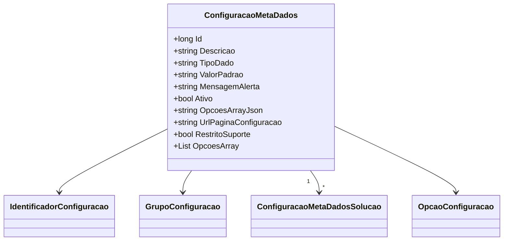

# ConfiguracaoMetaDados
**Namespace**: IsthmusWinthor.Dominio.Entidades  
**Nome do Arquivo**: ConfiguracaoMetaDados.cs  

## Visão Geral e Responsabilidade
A classe `ConfiguracaoMetaDados` representa as configurações de metadados que são utilizadas no sistema. Ela é responsável por armazenar informações como o tipo de dado, valor padrão, mensagem de alerta e opções específicas que podem ser utilizadas para configurar o comportamento do sistema. O principal problema de negócio que esta classe resolve é a necessidade de gerenciar configurações de maneira flexível e intuitiva, permitindo que as opções sejam personalizáveis e facilmente acessíveis nas interfaces de usuário.

## Métodos de Negócio

### Método: `OpcoesArray`
- **Visibilidade**: Público (get)
- **Objetivo**: Este método garante a conversão de um JSON armazenado em `OpcoesArrayJson` em uma lista de `OpcaoConfiguracao`, desde que o tipo de dado (`TipoDado`) seja do tipo "array".
- **Comportamento**: 
  1. Verifica se `OpcoesArrayJson` está vazio ou se `TipoDado` não é "array".
  2. Se a condição anterior for verdadeira, retorna uma nova lista vazia de `OpcaoConfiguracao`.
  3. Tenta desserializar `OpcoesArrayJson` em uma lista de `OpcaoConfiguracao`.
  4. Se a desserialização falhar (por exemplo, devido a um JSON malformado), retorna uma nova lista vazia.
- **Retorno**: Retorna uma lista de `OpcaoConfiguracao` que contém as opções configuradas ou uma lista vazia caso não existam opções válidas ou a desserialização falhe.

```mermaid
flowchart TD
    A[Início]
    B{OpcoesArrayJson vazio ou TipoDado != "array?"}
    C[Retorna lista vazia]
    D[Deserializa OpcoesArrayJson]
    E{Erro na deserialização?}
    F[Retorna lista vazia]
    G[Retorna lista de OpçãoConfiguracao]

    A --> B
    B -- Sim --> C
    B -- Não --> D
    D --> E
    E -- Sim --> F
    E -- Não --> G
```

## Propriedades Calculadas e de Validação
- **OpcoesArray**: Esta propriedade é calculada com base no conteúdo de `OpcoesArrayJson`. O retorno da propriedade depende da validação de que `OpcoesArrayJson` não está vazio e que `TipoDado` é igual a "array". Se a validação não for atendida, a propriedade retorna uma lista vazia.

## Navigation Property
- **IdentificadorConfiguracao**: [IdentificadorConfiguracao](IdentificadorConfiguracao.md)  
- **GrupoConfiguracao**: [GrupoConfiguracao](GrupoConfiguracao.md)  
- **ConfiguracaoMetaDadosSolucao**: [ConfiguracaoMetaDadosSolucao](ConfiguracaoMetaDadosSolucao.md)  

## Tipos Auxiliares e Dependências
- **Enumeradores e Dependências**:
  - [TipoDado](TipoDado.md)  
  - [OpcaoConfiguracao](OpcaoConfiguracao.md)  

## Diagrama de Relacionamentos

---
Gerada em 29/12/2025 20:22:59
