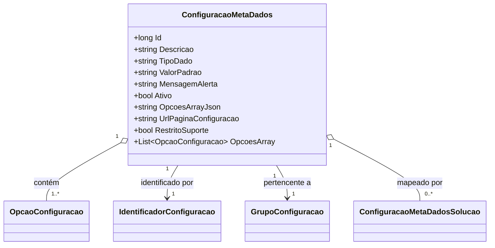

# ConfiguracaoMetaDados
**Namespace**: IsthmusWinthor.Dominio.Entidades  
**Nome do Arquivo**: ConfiguracaoMetaDados.cs  

## Visão Geral e Responsabilidade
A classe `ConfiguracaoMetaDados` atua como um agregador de informações de configuração dentro do sistema. Seu papel é garantir que os dados relacionados a diferentes configurações possam ser armazenados, acessados e manipulados de forma consistente. Ela é fundamental para a personalização e a adaptação da aplicação, permitindo que os usuários finalizem suas configurações de acordo com suas necessidades específicas. O problema de negócio que ela resolve é a flexibilidade na configuração de diversos aspectos do sistema, permitindo uma adaptação customizada de acordo com o uso esperado.

## Métodos de Negócio

### OpcoesArray
- **Objetivo**: Este método garante que as opções de configuração sejam recuperadas adequadamente a partir de uma string JSON, permitindo que a configuração seja lida e transformada em uma lista utilizável de opções.
- **Comportamento**: 
  1. Verifica se `OpcoesArrayJson` é nulo ou vazio, ou se o `TipoDado` não é "array".
  2. Se a condição for verdadeira, retorna uma nova lista vazia de `OpcaoConfiguracao`.
  3. Tenta desserializar a string JSON em uma lista de `OpcaoConfiguracao`.
  4. Se a desserialização falhar por qualquer motivo (exceto nulidade), retorna uma nova lista vazia como fallback.
- **Retorno**: Retorna uma lista de `OpcaoConfiguracao`, que contém as opções disponíveis para a configuração se tudo ocorrer corretamente; caso contrário, retorna uma lista vazia.

```mermaid
flowchart TD
    A[Início] --> B{OpcoesArrayJson é nulo ou vazio?}
    B -- Sim --> C[Retornar nova lista vazia]
    B -- Não --> D{TipoDado é "array"?}
    D -- Não --> E[Retornar nova lista vazia]
    D -- Sim --> F[Tentar desserializar JSON]
    F --> G{Desserialização bem-sucedida?}
    G -- Sim --> H[Retornar lista de opcoes]
    G -- Não --> I[Retornar nova lista vazia]
```

## Propriedades Calculadas e de Validação
- **OpcoesArray**: É uma propriedade calculada que transforma um JSON armazenado em `OpcoesArrayJson` em uma lista de objetos do tipo `OpcaoConfiguracao`. A regra de negócio aqui é que somente se o tipo de dado for "array", a desserialização é tentada, garantindo que a representação de dados esteja correta e que as falhas na desserialização não causem erros no sistema.

## Navigations Property
- `IdentificadorConfiguracao`: [IdentificadorConfiguracao](IdentificadorConfiguracao.md)  
- `GrupoConfiguracao`: [GrupoConfiguracao](GrupoConfiguracao.md)  
- `ConfiguracaoMetaDadosSolucao`: [ConfiguracaoMetaDadosSolucao](ConfiguracaoMetaDadosSolucao.md)  

## Tipos Auxiliares e Dependências
- `[OpcaoConfiguracao](OpcaoConfiguracao.md)`
- `[IdentificadorConfiguracao](IdentificadorConfiguracao.md)`
- `[GrupoConfiguracao](GrupoConfiguracao.md)`
- `[ConfiguracaoMetaDadosSolucao](ConfiguracaoMetaDadosSolucao.md)`

## Diagrama de Relacionamentos


Esta documentação técnica sintetiza as regras de negócio presentes na classe `ConfiguracaoMetaDados`, oferecendo uma visão clara das suas responsabilidades e funcionalidades no contexto do sistema corporativo.
