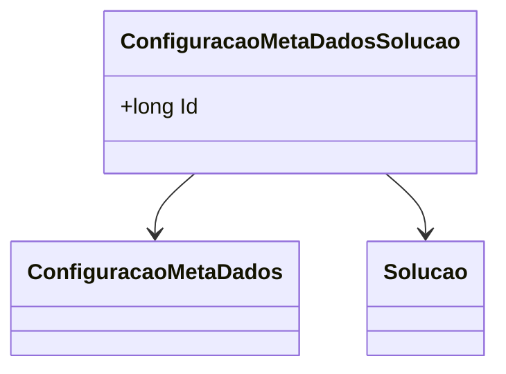

# ConfiguracaoMetaDadosSolucao

- **Namespace**: IsthmusWinthor.Dominio.Entidades
- **Nome do Arquivo**: ConfiguracaoMetaDadosSolucao.cs

## Visão Geral e Responsabilidade
A classe `ConfiguracaoMetaDadosSolucao` representa uma entidade que atua como um elo entre as configurações de meta dados e uma solução específica no sistema. O seu papel é estabelecer uma relação entre as regras de negócio definidas nas configurações e as soluções a serem aplicadas, permitindo uma gestão integrada e flexível dos meta dados na aplicação.

## Métodos de Negócio
A classe não possui métodos de negócio complexos, focando apenas em representações destas associações. Neste caso, não há métodos que contenham lógica para detalhar.

## Propriedades Calculadas e de Validação
A classe não contém propriedades que implementem lógica no `get` ou validação no `set`.

## Navigation Property
- `[ConfiguracaoMetaDados](ConfiguracaoMetaDados.md)`: Representa a configuração de meta dados associada.
- `[Solucao](Solucao.md)`: Representa a solução associada à configuração de meta dados.

## Tipos Auxiliares e Dependências
Nenhum enumerador ou classe auxiliar é utilizada diretamente na classe `ConfiguracaoMetaDadosSolucao`.

## Diagrama de Relacionamentos

