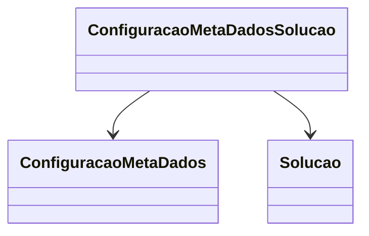

# ConfiguracaoMetaDadosSolucao
**Namespace**: IsthmusWinthor.Dominio.Entidades  
**Nome do Arquivo**: ConfiguracaoMetaDadosSolucao.cs  

## Visão Geral e Responsabilidade
A classe `ConfiguracaoMetaDadosSolucao` representa uma entidade de configuração que relaciona um conjunto de meta-dados a uma solução específica dentro do sistema. Seu principal papel é estabelecer uma associação entre as `ConfiguracaoMetaDados` e as `Solucao`, permitindo que as soluções sejam corretamente importadas e configuradas conforme suas instruções meta-dados. Isso garante que informações críticas associadas a cada solução sejam manipuladas de forma coesa e integradas ao seu fluxo de trabalho, atendendo assim às necessidades de gestão e operação da aplicação.

## Métodos de Negócio
### Título: N/A (Não possui métodos de negócio complexos)
- **Objetivo**: Não se aplica, pois a classe não contém lógica de negócios implementada em métodos.
- **Comportamento**: Não se aplica.
- **Retorno**: Não se aplica.

## Propriedades Calculadas e de Validação
- Nenhuma propriedade calculada ou de validação foi identificada nesta classe.

## Navigations Property
- **ConfiguracaoMetaDados**: Representa a classe complexa relacionada aos meta-dados. [ConfiguracaoMetaDados](ConfiguracaoMetaDados.md)
- **Solucao**: Representa a classe complexa associada a uma solução. [Solucao](Solucao.md)

## Tipos Auxiliares e Dependências
- Nenhum enumerador ou classe auxiliar foi identificado como dependência direta nesta classe.

## Diagrama de Relacionamentos

---
Gerada em 29/12/2025 20:23:06
