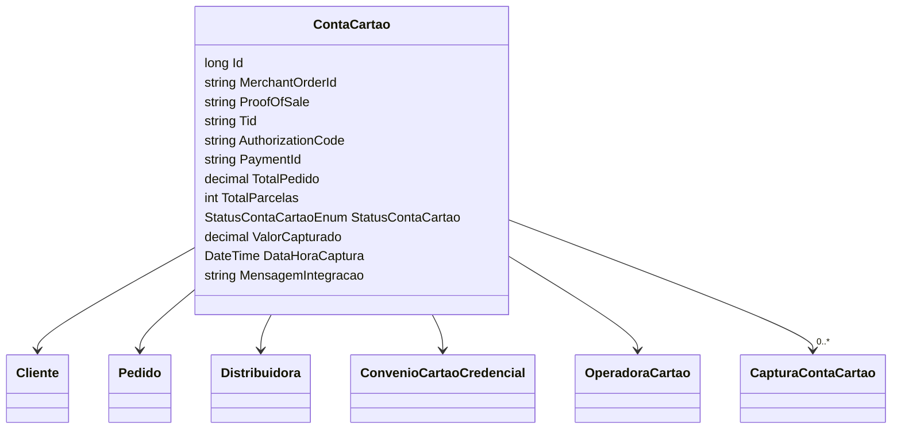

# ContaCartao
**Namespace**: IsthmusWinthor.Dominio.Entidades  
**Nome do Arquivo**: ContaCartao.cs  

## Visão Geral e Responsabilidade
A classe `ContaCartao` representa a entidade de domínio que gerencia informações e estados relativos a uma conta vinculada a transações de cartão de crédito em um sistema de pagamentos. O principal papel desta classe é manter a integridade dos dados relacionados ao processamento de pagamentos, incluindo informações sobre o cliente, pedidos e capturas financeiras. Ela resolve problemas de negócio ao centralizar dados críticos que facilitam a análise e o gerenciamento de transações financeiras.

## Métodos de Negócio
- **Título**: (não há métodos relevantes com lógica)

Neste caso, a classe não possui métodos com lógica significativa. Portanto, não é aplicável a seção sobre métodos de negócios.

## Propriedades Calculadas e de Validação
- **TotalPedido**: Representa o valor total do pedido. Deve ser maior ou igual a zero, validando assim a integridade financeira.
- **ValorCapturado**: Registra o total que foi capturado de uma determinada transação. Este valor, em um cenário real, deve ser sempre menor ou igual a `TotalPedido`, assegurando que não ocorra captura de valores superiores ao autorizado.

## Navigations Property
- [Cliente](Cliente.md)
- [Pedido](Pedido.md)
- [Distribuidora](Distribuidora.md)
- [ConvenioCartaoCredencial](ConvenioCartaoCredencial.md)
- [OperadoraCartao](OperadoraCartao.md)
- [CapturaContaCartao](CapturaContaCartao.md)

## Tipos Auxiliares e Dependências
- [StatusContaCartaoEnum](StatusContaCartaoEnum.md)

## Diagrama de Relacionamentos

---
Gerada em 29/12/2025 20:23:16
