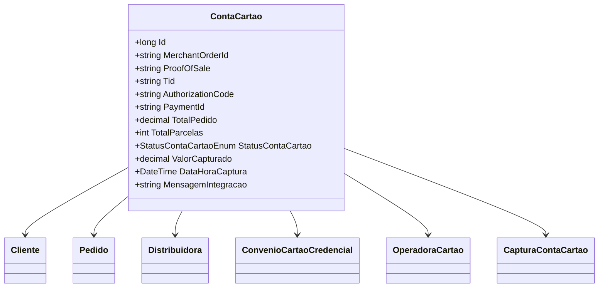

# ContaCartao

- **Namespace**: IsthmusWinthor.Dominio.Entidades
- **Nome do Arquivo**: ContaCartao.cs

## Visão Geral e Responsabilidade
A classe `ContaCartao` representa uma entidade crucial no sistema de pagamento, gerenciando as informações relacionadas a uma transação de cartão de crédito. Ela agrega informações sobre o cliente, pedido, distribuidora e credenciais de pagamento. O principal problema de negócio que ela resolve é garantir que todos os detalhes da transação sejam corretamente associados e gerenciados, desde o pedido até a captura do pagamento.

## Métodos de Negócio
A classe `ContaCartao` atualmente não possui métodos de negócio com lógica complexa que requerem detalhamento. Assim, todos os métodos presentes são considerados simples getters e setters.

## Propriedades Calculadas e de Validação
Atualmente, a classe não possui propriedades com lógica de cálculo no `get` ou validação no `set`. Todas as propriedades apresentadas são anêmicas, servindo apenas como transportadores de dados.

## Navigations Property
- **Cliente**: `[Cliente](Cliente.md)`
- **Pedido**: `[Pedido](Pedido.md)`
- **Distribuidora**: `[Distribuidora](Distribuidora.md)`
- **ConvenioCartaoCredencial**: `[ConvenioCartaoCredencial](ConvenioCartaoCredencial.md)`
- **OperadoraCartao**: `[OperadoraCartao](OperadoraCartao.md)`
- **CapturaContaCartao**: `[CapturaContaCartao](CapturaContaCartao.md)`

## Tipos Auxiliares e Dependências
- **StatusContaCartaoEnum**: `[StatusContaCartaoEnum](StatusContaCartaoEnum.md)`

## Diagrama de Relacionamentos

