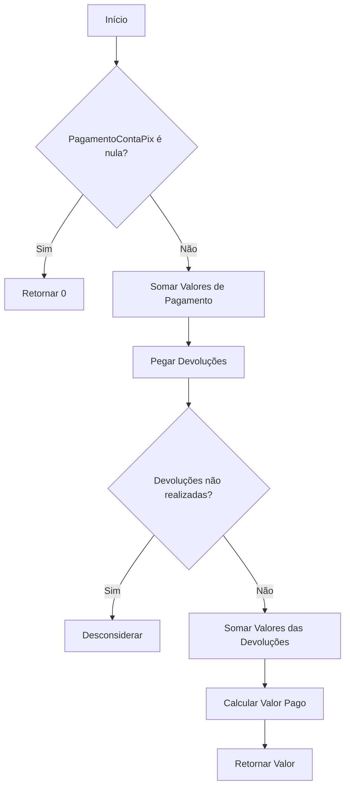
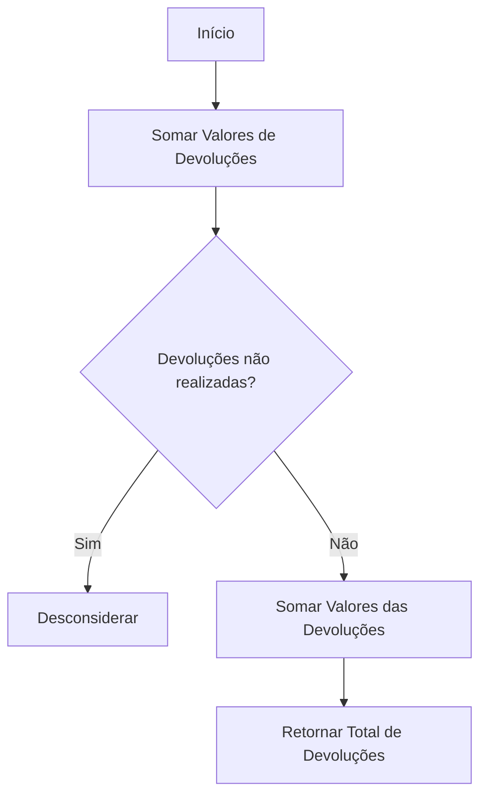
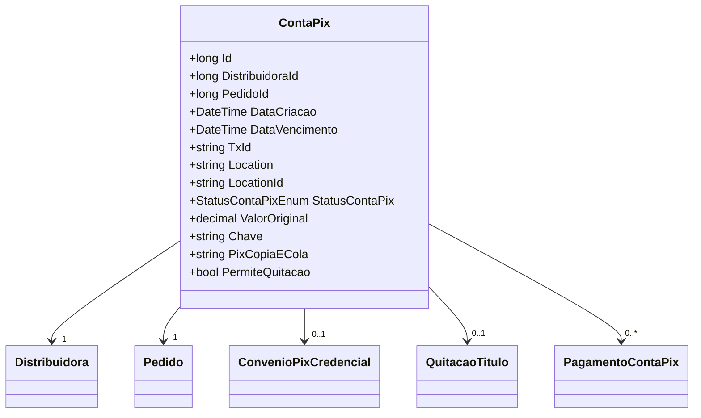

# ContaPix
**Namespace**: IsthmusWinthor.Dominio.Entidades  
**Nome do Arquivo**: ContaPix.cs  

## Visão Geral e Responsabilidade
A classe `ContaPix` representa uma instância de cobrança através do sistema de pagamentos PIX. Ela é responsável por gerenciar informações relacionadas ao recebimento de pagamentos, controle de devoluções e o status das transações realizadas na plataforma. O principal problema de negócio que essa classe resolve é a correta contabilização dos valores pagos e devolvidos, assegurando a integridade financeira do processo de cobrança.

## Métodos de Negócio

### ValorPagoConta
- **Título**: `ValorPagoConta` (Público)
- **Objetivo**: Garantir que o valor total pago pelo cliente seja calculado corretamente, descontando quaisquer devoluções realizadas.
- **Comportamento**:
  1. Verifica se a coleção `PagamentoContaPix` é nula. Se for, retorna 0.
  2. Soma todos os valores pagos contidos na coleção `PagamentoContaPix`.
  3. Para cada pagamento, busca as suas devoluções (`DevolucoesPagamentoContaPix`).
  4. Filtra as devoluções que não estão marcadas como não realizadas (`StatusDevolucao != StatusDevolucaoPixEnum.NAO_REALIZADO`).
  5. Calcula a soma total das devoluções e subtrai esse total do total de pagamentos recebidos.
- **Retorno**: Retorna um decimal representando o valor total que foi efetivamente pago pelo cliente após considerar as devoluções.

### ValorTotalDevolucoes
- **Título**: `ValorTotalDevolucoes` (Público)
- **Objetivo**: Calcular o total de valores devolvidos em relação aos pagamentos realizados pela `ContaPix`.
- **Comportamento**:
  1. Acessa a coleção `PagamentoContaPix`.
  2. Para cada pagamento, busca suas devoluções.
  3. Filtra devoluções que estão marcadas como não realizadas.
  4. Soma todos os valores das devoluções.
- **Retorno**: Retorna o valor total das devoluções realizadas.

## Propriedades Calculadas e de Validação
- **Nenhuma propriedade calculada ou de validação foi identificada nesta classe.**

## Navigations Property
- [`Distribuidora`](Distribuidora.md)
- [`Pedido`](Pedido.md)
- [`ConvenioPixCredencial`](ConvenioPixCredencial.md)
- [`QuitacaoTitulo`](QuitacaoTitulo.md)
- [`PagamentoContaPix`](PagamentoContaPix.md)

## Tipos Auxiliares e Dependências
- [`StatusContaPixEnum`](StatusContaPixEnum.md)
- [`StatusDevolucaoPixEnum`](StatusDevolucaoPixEnum.md)
- `DevolucaoPagamentoContaPix`

## Diagrama de Relacionamentos

