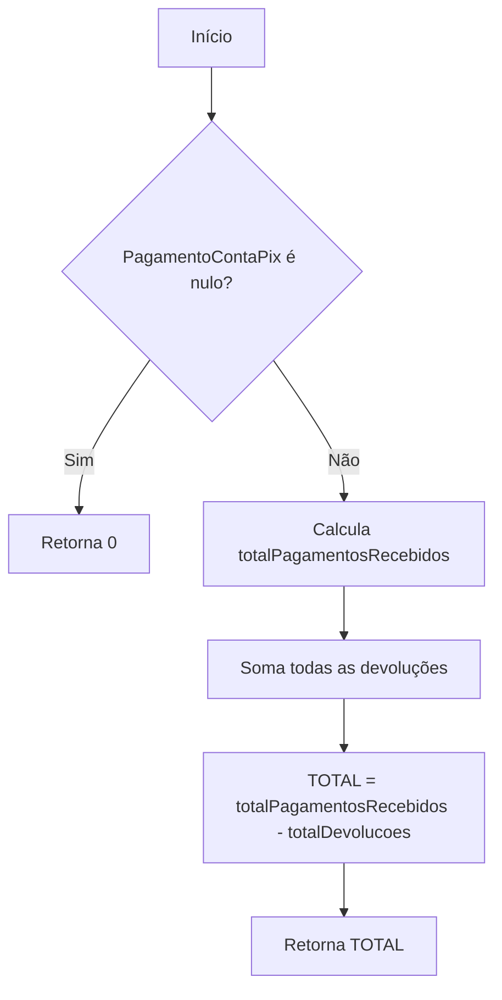
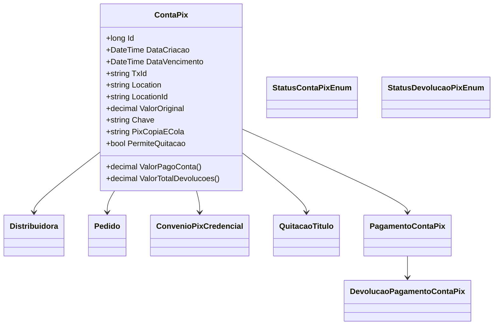

# ContaPix
**Namespace**: IsthmusWinthor.Dominio.Entidades  
**Nome do Arquivo**: ContaPix.cs  

## Visão Geral e Responsabilidade
A classe `ContaPix` representa a cobrança gerada no sistema quando um pedido é realizado na plataforma. Ela é responsável por gerenciar detalhes financeiros relacionados ao pagamento via PIX, efetivando as interações entre o pedido e a distribuidora. A classe implementa regras de negócio relacionadas ao controle e validação dos pagamentos, bem como ao tratamento de devoluções, garantindo a integridade e a coerência dos dados financeiros.

## Métodos de Negócio

### Título: ValorPagoConta
- **Visibilidade**: public
- **Objetivo**: Calcula o valor total que foi pago pelo cliente, descontadas as devoluções realizadas.

- **Comportamento**:
  1. Verifica se exista pagamentos registrados (`PagamentoContaPix`), caso contrário, retorna 0.
  2. Soma todos os valores pagos registrados em `PagamentoContaPix` (`totalPagamentosRecebidos`).
  3. Para cada pagamento, verifica e soma os valores das devoluções realizadas que possuem status diferente de "não realizado" (`totalDevolucoesFeitas`).
  4. Retorna a diferença entre o total de pagamentos e o total de devoluções.

- **Retorno**: O valor retornado é um `decimal` representando o total líquido após as devoluções.

### Título: ValorTotalDevolucoes
- **Visibilidade**: public
- **Objetivo**: Calcula o valor total das devoluções realizadas.

- **Comportamento**:
  1. Avalia e soma todos os valores das devoluções que estão registradas nos pagamentos (`PagamentoContaPix`).
  2. Filtra apenas as devoluções cujo status não é "não realizado".
  3. Retorna o total dessas devoluções.

- **Retorno**: O valor retornado é um `decimal` representando o total de devoluções que foram efetivamente realizadas.

## Propriedades Calculadas e de Validação
Não há propriedades com lógica no `get` ou validação no `set`.

## Navigation Property
- [Distribuidora](Distribuidora.md)
- [Pedido](Pedido.md)
- [ConvenioPixCredencial](ConvenioPixCredencial.md)
- [QuitacaoTitulo](QuitacaoTitulo.md)
- [PagamentoContaPix](PagamentoContaPix.md)

## Tipos Auxiliares e Dependências
- [StatusContaPixEnum](StatusContaPixEnum.md)
- [StatusDevolucaoPixEnum](StatusDevolucaoPixEnum.md)
- [DevolucaoPagamentoContaPix](DevolucaoPagamentoContaPix.md)

## Diagrama de Relacionamentos

---
Gerada em 29/12/2025 20:23:35
