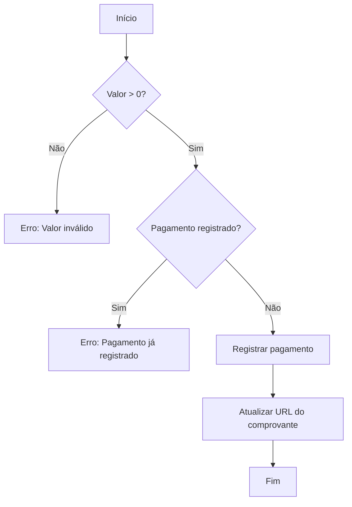
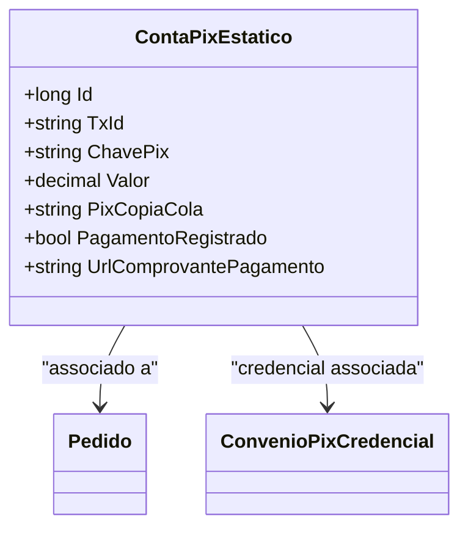

# ContaPixEstatico
**Namespace**: IsthmusWinthor.Dominio.Entidades  
**Nome do Arquivo**: ContaPixEstatico.cs  

## Visão Geral e Responsabilidade
A classe `ContaPixEstatico` representa a entidade de dados de cobrança via PIX gerada durante a criação de um pedido. Ela mantém informações essenciais para o registro e comprovação de pagamentos, garantindo que todos os dados necessários para a transação estejam organizados e acessíveis. Esse modelo de domínio assegura que o sistema de pagamentos tenha controle sobre as transações feitas, promovendo integridade e confiabilidade na gestão dos pagamentos.

## Métodos de Negócio
- **Título**: `RegistrarPagamento` (public)
  - **Objetivo**: Garante que o pagamento tenha sido corretamente registrado e processado.
  - **Comportamento**: 
    1. Verifica se o valor do pagamento é maior que zero.
    2. Se o pagamento já foi registrado, lança uma exceção.
    3. Marca o status de `PagamentoRegistrado` como verdadeiro.
    4. Atualiza a `UrlComprovantePagamento` com o link correspondente.
  - **Retorno**: Não retorna valor, mas altera o estado da entidade ao registrar o pagamento.

## Propriedades Calculadas e de Validação
- `Valor`: O valor do pagamento deve ser um número positivo, refletindo a quantia de dinheiro que está sendo transacionada. Qualquer valor não positivo deve gerar uma exceção ao tentar registrar o pagamento.

## Navigations Property
- [Pedido](Pedido.md): Representa o pedido associado a essa cobrança.
- [ConvenioPixCredencial](ConvenioPixCredencial.md): Representa a credencial associada ao convênio do PIX.

## Tipos Auxiliares e Dependências
- Não existem enumeradores ou classes estáticas/helpers diretamente referenciados nesta classe.

## Diagrama de Relacionamentos

---
Gerada em 29/12/2025 20:23:46
