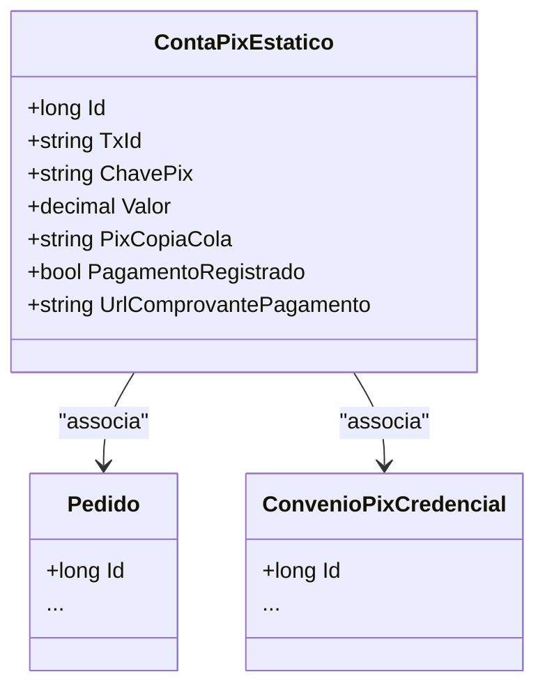

# ContaPixEstatico

**Namespace**: IsthmusWinthor.Dominio.Entidades  
**Nome do Arquivo**: ContaPixEstatico.cs  

## Visão Geral e Responsabilidade
A classe `ContaPixEstatico` representa os dados de cobrança por meio de uma transação do sistema de pagamentos PIX, gerados durante o processo de criação de um pedido. Ela tem como responsabilidade guardar as informações necessárias para processar e validar pagamentos, assegurando que todos os dados relevantes do pagamento sejam corretamente registrados e acessíveis.

## Métodos de Negócio
A classe `ContaPixEstatico` atualmente não possui métodos de negócio que implementam lógica além dos simples getters e setters. Portanto, não há documentação específica de métodos neste momento.

## Propriedades Calculadas e de Validação
A classe possui propriedades simples sem lógica de validação ou cálculo no getter/setter.

## Navigation Properties
- [`Pedido`](Pedido.md): Representa a conexão da conta PIX com um pedido específico.
- [`ConvenioPixCredencial`](ConvenioPixCredencial.md): Representa a credencial associada à transação PIX.

## Tipos Auxiliares e Dependências
Nenhum enumerador ou classe auxiliar é utilizado diretamente pela classe `ContaPixEstatico`.

## Diagrama de Relacionamentos

