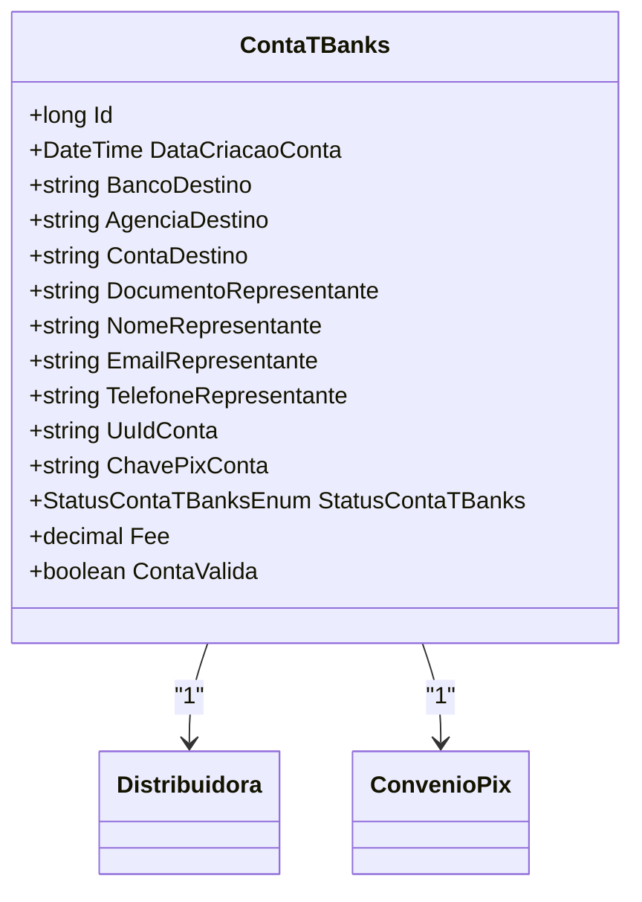

# ContaTBanks
**Namespace**: IsthmusWinthor.Dominio.Entidades  
**Nome do Arquivo**: ContaTBanks.cs  

## Visão Geral e Responsabilidade
A classe `ContaTBanks` representa uma conta bancária associada a uma distribuidora, contendo informações relacionadas ao acordo de pagamento via Pix. Ela lida com a gestão da conta dentro do sistema, incluindo a validação de seu status e outros dados críticos para a operação financeira. Seu objetivo principal é garantir que apenas contas válidas sejam utilizadas nas transações, conforme a regra de negócio estabelecida.

## Métodos de Negócio

### Título: ContaValida (Propriedade Calculada)
**Objetivo**: Garantir que a conta esteja aprovada e que a chave Pix esteja preenchida, validando assim a sua utilização nos processos financeiros.  
**Comportamento**: 
1. A propriedade calcula o estado da conta ao verificar se o `StatusContaTBanks` é igual a `StatusContaTBanksEnum.Aprovada`.
2. Além disso, verifica se a `ChavePixConta` não é nula ou vazia.
3. O resultado final é um valor booleano indicando se a conta é válida ou não.

**Retorno**: `true` se a conta estiver aprovada e com uma chave Pix válida; caso contrário, retorna `false`.

## Propriedades Calculadas e de Validação

### Propriedades 
- **ContaValida**: Esta propriedade oferece uma forma de validar a conta através da combinação do status da conta e a existência da chave Pix. 
  - Regra: Uma conta é considerada válida apenas quando seu status é "Aprovada" e uma chave Pix está disponível.

## Navigations Property

- `[Distribuidora](Distribuidora.md)`
- `[ConvenioPix](ConvenioPix.md)`

## Tipos Auxiliares e Dependências

- `[StatusContaTBanksEnum](StatusContaTBanksEnum.md)`

## Diagrama de Relacionamentos

