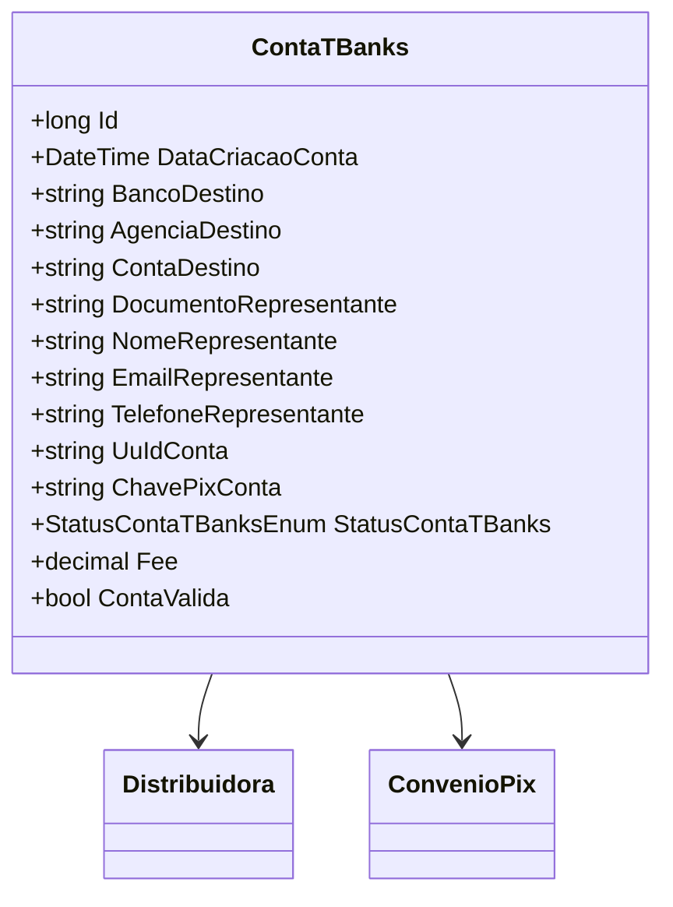

# ContaTBanks

**Namespace**: IsthmusWinthor.Dominio.Entidades  
**Nome do Arquivo**: ContaTBanks.cs  

## Visão Geral e Responsabilidade
A classe `ContaTBanks` representa uma conta bancária vinculada a uma distribuidora no contexto do sistema financeiro da empresa. Ela é responsável por manter as informações necessárias sobre a conta, como os dados do representante e o status da conta, resolvendo o problema de gestão e validação de contas usadas para a transação financeira via Pix.

## Métodos de Negócio
### Título: ContaValida (Propriedade Calculada)
- **Objetivo**: Garante que a conta bancária está na condição adequada para ser utilizada. Verifica se a conta está aprovada e se a chave Pix está disponível.
- **Comportamento**:
  1. Verifica se o status da conta (`StatusContaTBanks`) é igual a `Aprovada`.
  2. Valida se a propriedade `ChavePixConta` não é nula ou vazia.
  3. Retorna `true` se ambas as condições forem atendidas, caso contrário, retorna `false`.
- **Retorno**: `bool` que representa se a conta está válida para uso em transações.

## Propriedades Calculadas e de Validação
- **ContaValida**: Essa propriedade determina se a conta está em um estado válido para operações de pagamento. As regras de negócios estabelecem que uma conta deve estar aprovada e ter uma chave Pix válida para ser considerada válida.

## Navigations Property
- [Distribuidora](Distribuidora.md)
- [ConvenioPix](ConvenioPix.md)

## Tipos Auxiliares e Dependências
- [StatusContaTBanksEnum](StatusContaTBanksEnum.md)

## Diagrama de Relacionamentos

---
Gerada em 29/12/2025 20:23:57
