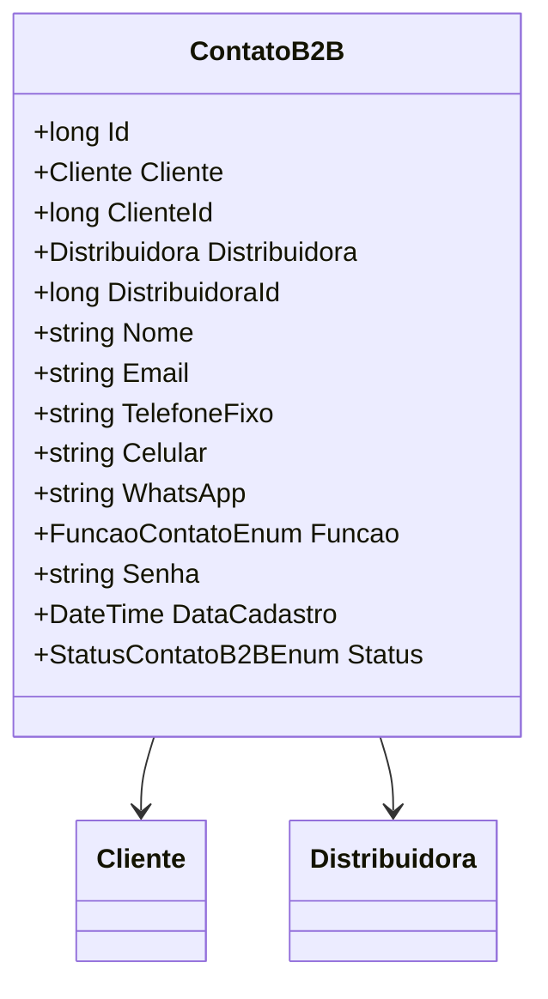

# ContatoB2B
**Namespace**: IsthmusWinthor.Dominio.Entidades  
**Nome do Arquivo**: ContatoB2B.cs  

## Visão Geral e Responsabilidade
A classe `ContatoB2B` representa uma entidade que encapsula as informações de contato de um cliente para uma distribuidora no contexto B2B (Business to Business). O objetivo principal dessa classe é gerenciar e organizar os dados de contato associados a um cliente, facilitando relações comerciais com as distribuidoras. A classe garante a integridade dos dados relacionados ao contato, tais como identificação, informações de comunicação e função do contato dentro da empresa.

## Propriedades Calculadas e de Validação
- As propriedades não apresentam lógica de cálculo ou validação complexa em seus `get` ou `set`. Todas as propriedades são armazenadas como valores simples (anêmicos), sem regras específicas que alterem seu comportamento ou valor ao serem acessadas ou definidas.

## Navigation Property
- [Cliente](Cliente.md)
- [Distribuidora](Distribuidora.md)

## Tipos Auxiliares e Dependências
- [FuncaoContatoEnum](FuncaoContatoEnum.md)
- [StatusContatoB2BEnum](StatusContatoB2BEnum.md)

## Diagrama de Relacionamentos

---
Gerada em 29/12/2025 20:24:07
