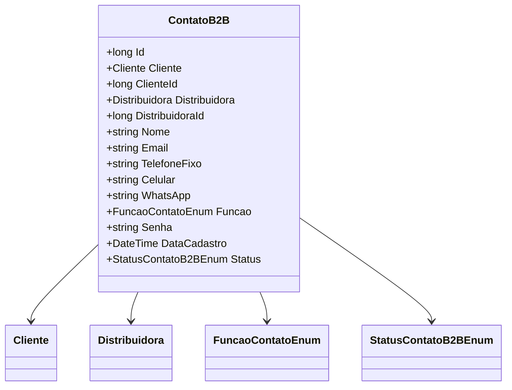

# ContatoB2B
- **Namespace**: IsthmusWinthor.Dominio.Entidades
- **Nome do Arquivo**: ContatoB2B.cs

## Visão Geral e Responsabilidade
A classe `ContatoB2B` representa um contato de negócios entre um cliente e uma distribuidora dentro do sistema. Ela atua como um modelo de domínio que capta informações essenciais sobre o contato, como nome, e-mail, telefone e função do contato. O objetivo é organizar e gerenciar dados de contato para facilitar a comunicação e a interação entre as partes envolvidas no contexto B2B (Business to Business).

## Métodos de Negócio
### Título: N/A
- **Objetivo**: Não há métodos com lógica complexa a serem documentados nesta classe.

## Propriedades Calculadas e de Validação
- Não existem propriedades com lógica no `get` ou validações no `set` nesta classe.

## Navigation Properties
- `[Cliente](Cliente.md)`: Representa a associação com a classe `Cliente`, indicando a relação entre o contato e um cliente específico.
- `[Distribuidora](Distribuidora.md)`: Representa a associação com a classe `Distribuidora`, indicando a relação entre o contato e uma distribuidora específica.

## Tipos Auxiliares e Dependências
- `[FuncaoContatoEnum](FuncaoContatoEnum.md)`: Enum que define as funções possíveis dos contatos B2B.
- `[StatusContatoB2BEnum](StatusContatoB2BEnum.md)`: Enum que representa o status atual do contato.

## Diagrama de Relacionamentos

