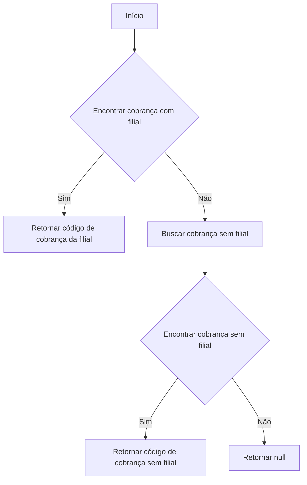
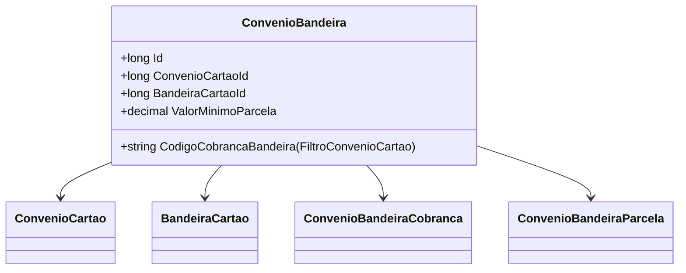

# ConvenioBandeira
**Namespace**: IsthmusWinthor.Dominio.Entidades  
**Nome do Arquivo**: ConvenioBandeira.cs  

## Visão Geral e Responsabilidade
A classe `ConvenioBandeira` representa a associação entre um convênio de cartão e a bandeira do cartão, facilitando o agrupamento de regras de cobrança e a aplicação de valores mínimos para parcelas. Ela garante que as informações de cobrança sejam corretamente associadas com base nas filiais que utilizam determinado convênio, assegurando que os dados financeiros relevantes estejam sempre à disposição.

## Métodos de Negócio

### Título: `CodigoCobrancaBandeira(FiltroConvenioCartao filtroConvenioCartao)` - Visibilidade: `public`
- **Objetivo**: Este método verifica a disponibilidade de um código de cobrança baseado em filiais específicas do convênio, retornando um código que se aplica ao contexto fornecido.
- **Comportamento**:
  1. O método recebe um filtro que contém o código da filial buscada.
  2. Ele busca a primeira cobrança (`ConvenioBandeiraCobrancas`) que contém o código da filial em sua lista de códigos.
  3. Se encontrar, retorna o código de cobrança correspondente.
  4. Se não encontrar, busca um código de cobrança que não possua códigos de filial associados (aplicável a todas as filiais).
- **Retorno**: Retorna o código de cobrança como uma string, ou `null` se nenhuma cobrança estiver disponível.

## Propriedades Calculadas e de Validação
- Não foram identificadas propriedades com lógica no `get` ou validação no `set` nesta classe.

## Navigations Property
- `[ConvenioCartao](ConvenioCartao.md)`: Representa o convênio de cartão associado.
- `[BandeiraCartao](BandeiraCartao.md)`: Representa a bandeira do cartão associado.
- `[ConvenioBandeiraCobranca](ConvenioBandeiraCobranca.md)`: Representa as cobranças associadas a este convênio.
- `[ConvenioBandeiraParcela](ConvenioBandeiraParcela.md)`: Representa as parcelas associadas a este convênio.

## Tipos Auxiliares e Dependências
- `FiltroConvenioCartao`: Classe utilizada como entrada no método `CodigoCobrancaBandeira`.
- `ConvenioBandeiraCobranca`: Representa as cobranças específicas do convênio de bandeira.

## Diagrama de Relacionamentos

