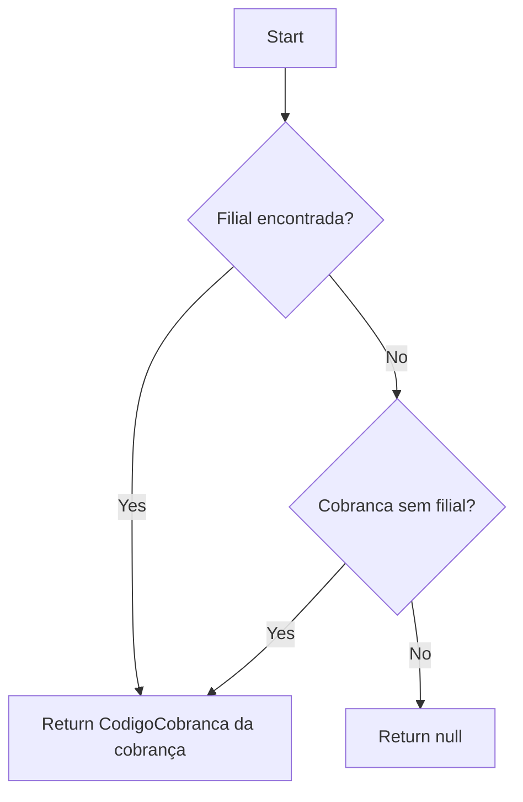
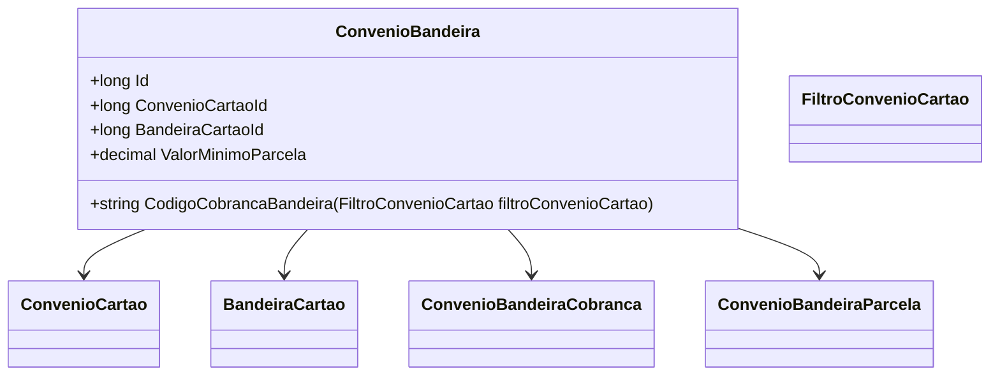

# ConvenioBandeira
**Namespace**: IsthmusWinthor.Dominio.Entidades  
**Nome do Arquivo**: ConvenioBandeira.cs  

## Visão Geral e Responsabilidade
A classe `ConvenioBandeira` representa um vinculo entre um convênio de cartão e a bandeira correspondente, gerenciando a cobrança e as parcelas associadas. O problema de negócio que ela resolve envolve a associação eficiente entre diferentes meios de pagamento e suas configurações, permitindo que o sistema encontre o código de cobrança correto com base na filial utilizada, além de manter condições claras e organizadas armazenadas nas coleções de cobranças e parcelas.

## Métodos de Negócio
### Título: `CodigoCobrancaBandeira(FiltroConvenioCartao filtroConvenioCartao)` - `public`
#### Objetivo:
Garante a recuperação do código de cobrança apropriado baseado na filial informada através do filtro de convênio de cartão.

#### Comportamento:
1. A função começa filtrando a coleção `ConvenioBandeiraCobrancas` para encontrar a cobrança que contém a filial indicada no parâmetro `filtroConvenioCartao`.
2. Se uma cobrança correspondente for encontrada, ela retorna o `CodigoCobranca` dessa cobrança.
3. Caso contrário, a função busca por uma cobrança que não esteja vinculada a nenhuma filial (ou seja, onde `CodigosFiliais` esteja vazio).
4. Se encontrar essa cobrança, retorna o respectivo `CodigoCobranca`.
5. Se nenhuma cobrança válida for encontrada nas etapas anteriores, retorna `null`.

#### Retorno:
Retorna uma string representando o código de cobrança encontrado ou `null` se nenhuma cobrança válida for localizada.

## Propriedades Calculadas e de Validação
Nenhuma propriedade nesta classe contém lógica no `get` ou validação no `set`.

## Navigations Property
- `ConvenioCartao`: [ConvenioCartao](ConvenioCartao.md)
- `BandeiraCartao`: [BandeiraCartao](BandeiraCartao.md)
- `ConvenioBandeiraCobrancas`: [ConvenioBandeiraCobranca](ConvenioBandeiraCobranca.md)
- `Parcelas`: [ConvenioBandeiraParcela](ConvenioBandeiraParcela.md)

## Tipos Auxiliares e Dependências
- `FiltroConvenioCartao`: [FiltroConvenioCartao](FiltroConvenioCartao.md)

## Diagrama de Relacionamentos

---
Gerada em 29/12/2025 20:24:21
